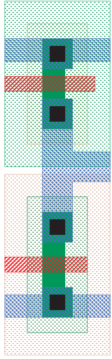

* TOC
{:toc }

Magic Tutorial \#2: Basic Painting and
Selection  
John Ousterhout  
Computer Science Division  
Electrical Engineering and Computer Sciences  
University of California  
Berkeley, CA 94720  
(Updated by others, too.)  
This tutorial corresponds to Magic version 7.  

Tutorials to read first:

<table class="tabbing" data-cellpadding="0" data-border="0">
<tbody>
<tr class="odd tabbing" style="vertical-align:baseline;">
<td class="tabbing">Magic Tutorial #1: Getting Started</td>
</tr>
</tbody>
</table>

Commands introduced in this
tutorial:

<table class="tabbing" data-cellpadding="0" data-border="0">
<colgroup>
<col style="width: 100%" />
</colgroup>
<tbody>
<tr class="odd tabbing" style="vertical-align:baseline;">
<td class="tabbing">:box, :clockwise, :copy, :erase, :findbox :grid,
:label, 
:layers, :macro, :move, :paint, :redo, :save, :select, 
:sideways, :undo, :upsidedown, :view, :what, :writeall, :zoom</td>
</tr>
</tbody>
</table>

Macros introduced in this tutorial:

<table class="tabbing" data-cellpadding="0" data-border="0">
<tbody>
<tr class="odd tabbing" style="vertical-align:baseline;">
<td class="tabbing">a, A, c, d, ̂D, e, E, g, G, q, Q, r, R, s, S, t, T,
u, U, v, w, W, z, Z, 4</td>
</tr>
</tbody>
</table>

## 1  Cells and Paint

In Magic, a circuit layout is a hierarchical collection of cells. Each cell contains three things:
colored shapes, called paint, that
define the circuit’s structure; textual labels attached to the paint; and subcells, which are instances of other
cells. The paint is what determines the eventual function of the VLSI
circuit. Labels and subcells are a convenience for you in managing the
layout and provide a way of communicating information between various
synthesis and analysis tools. This tutorial explains how to create and
edit paint and labels in simple single-cell designs, using the basic
painting commands. “Magic Tutorial \#3: Advanced Painting (Wiring and
Plowing)” describes some more advanced features for manipulating paint.
For information on how to build up cell hierarchies, see “Magic Tutorial
\#4: Cell Hierarchies”.

## 2  Painting and Erasing

Enter Magic to edit the cell tut2a
(type magic tut2a to the Unix
shell; follow the directions in “Tutorial \#1: Getting Started” if you
have any problems with this). The tut2a
cell is a sort of palette: it shows a splotch of each of several
paint layers and gives the names that Magic uses for the layers.

The two basic layout operations are painting and erasing. They can be
invoked using the :paint and :erase long commands, or using the
buttons. The easiest way to paint and erase is with the mouse buttons.
To paint, position the box over the area you’d like to paint, then move
the cursor over a color and click the middle mouse button. To erase
everything in an area, place the box over the area, move the cursor over
a blank spot, and click the middle mouse button. Try painting and
erasing various colors. If the screen gets totally messed up, you can
always exit Magic and restart it. While you’re painting, white dots may
occasionally appear and disappear. These are design rule violations
detected by Magic, and will be explained in “Magic Tutorial \#6: Design
Rule Checking”. You can ignore them for now.

It’s completely legal to paint one layer on top of another. When this
happens, one of three things may occur. In some cases, the layers are
independent, so what you’ll see is a combination of the two, as if each
were a transparent colored foil. This happens, for example, if you paint
metal1 (blue) on top of polysilicon (red). In other cases, when you
paint one layer on top of another you’ll get something different from
either of the two original layers. For example, painting poly on top of
ndiff produces ntransistor (try this). In still other cases the new
layer replaces the old one: this happens, for example, if you paint a
pcontact on top of ntransistor. Try painting different layers on top of
each other to see what happens. The meaning of the various layers is
discussed in more detail in Section 11 below.

There is a second way of erasing paint that allows you to erase some
layers without affecting others. This is the macro ̂D (control-D, for “Delete paint”). To use it, position the
box over the area to be erased, then move the crosshair over a splotch
of paint containing the layer(s) you’d like to erase. Type ̂D key on the text keyboard: the colors
underneath the cursor will be erased from the area underneath the box,
but no other layers will be affected. Experiment around with the ̂D macro to try different combinations of
paints and erases. If the cursor is over empty space then the ̂D macro is equivalent to the middle mouse
button: it erases everything.

You can also paint and erase using the long commands

<table class="tabbing" data-cellpadding="0" data-border="0">
<colgroup>
<col style="width: 100%" />
</colgroup>
<tbody>
<tr class="odd tabbing" style="vertical-align:baseline;">
<td class="tabbing">:paint layers 
:erase layers</td>
</tr>
</tbody>
</table>

In each of these commands layers is
one or more layer names separated by commas (you can also use spaces for
separators, but only if you enclose the entire list in double-quotes).
Any layer can be abbreviated as long as the abbreviation is unambiguous.
For example, :paint poly,metal1 will
paint the polysilicon and metal1 layers. The macro ̂D is predefined by Magic to be :erase $
($ is a pseudo-layer that
means “all layers underneath the cursor”).

## 3  Undo

There are probably going to be times when you’ll do things that you’ll
later wish you hadn’t. Fortunately, Magic has an undo facility that you
can use to restore things after you’ve made mistakes. The command

<table class="tabbing" data-cellpadding="0" data-border="0">
<tbody>
<tr class="odd tabbing" style="vertical-align:baseline;">
<td class="tabbing">:undo</td>
</tr>
</tbody>
</table>

(or, alternatively, the macro u)
will undo the effects of the last command you invoked. If you made a
mistake several commands back, you can type :undo several times to undo successive
commands. However, there is a limit to all this: Magic only remembers
how to undo the last ten or so commands. If you undo something and then
decide you wanted it after all, you can undo the undo with the command

<table class="tabbing" data-cellpadding="0" data-border="0">
<tbody>
<tr class="odd tabbing" style="vertical-align:baseline;">
<td class="tabbing">:redo</td>
</tr>
</tbody>
</table>

(U is a macro for this command). Try
making a few paints and erases, then use :undo and :redo to work backwards and forwards
through the changes you made.

## 4  The Selection

Once you have painted a piece of layout, there are several commands you
can invoke to modify the layout. Many of them are based on the selection: you select one or more pieces
of the design, and then perform operations such as copying, deletion,
and rotation on the selected things. To see how the selection works,
load cell tut2b. You can do this by
typing :load tut2b if you’re still
in Magic, or by starting up Magic with the shell command magic tut2b.

The first thing to do is to learn how to select. Move the cursor over
the upper portion of the L-shaped blue area in tut2b, and type s, which is a macro for :select. The box will jump over to cover
the vertical part of the “L”. This operation selected a chunk of
material. Move the box away from the chunk, and you’ll see that a thin
white outline is left around the chunk to show that it’s selected. Now
move the cursor over the vertical red bar on the right of the cell and
type s. The box will move over that
bar, and the selection highlighting will disappear from the blue area.

If you type s several times without
moving the cursor, each command selects a slightly larger piece of
material. Move the cursor back over the top of the blue “L”, and type
s three times without moving the
cursor. The first s selects a chunk
(a rectangular region all of the same type of material). The second
s selects a region (all of the blue material in the
region underneath the cursor, rectangular or not). The third s selects a net (all of the material that is
electrically connected to the original chunk; this includes the blue
metal, the red polysilicon, and the contact that connects them).

The macro S (short for :select more) is just like s except that it adds on to the selection,
rather than replacing it. Move the cursor over the vertical red bar on
the right and type S to see how this
works. You can also type S multiple
times to add regions and nets to the selection.

If you accidentally type s or S when the cursor is over space, you’ll
select a cell (tut2b in this case).
You can just undo this for now. Cell selection will be discussed in
“Magic Tutorial \#4: Cell Hierarchies”.

You can also select material by area: place the box around the material
you’d like to select and type a
(short for :select area).
This will select all of the material underneath the box. You can use the
macro A to add material to the
selection by area, and you can use the long command

<table class="tabbing" data-cellpadding="0" data-border="0">
<tbody>
<tr class="odd tabbing" style="vertical-align:baseline;">
<td class="tabbing">:select [more]area
layers</td>
</tr>
</tbody>
</table>

to select only material on certain layers. Place the box around
everything in tut2b and type :select area
metal1 followed by :select more area
poly.

If you’d like to clear out the selection without modifying any of the
selected material, you can use the command

<table class="tabbing" data-cellpadding="0" data-border="0">
<tbody>
<tr class="odd tabbing" style="vertical-align:baseline;">
<td class="tabbing">:select
clear</td>
</tr>
</tbody>
</table>

or type the macro C. You can clear
out just a portion of the selection by typing :select less or :select less
area layers; the former
deselects paint in the order that :select
selects paint, while the latter deselects paint under the box
(just as :select area selects paint
under the box). For a synopsis of all the options to the :select command, type

<table class="tabbing" data-cellpadding="0" data-border="0">
<tbody>
<tr class="odd tabbing" style="vertical-align:baseline;">
<td class="tabbing">:select
help</td>
</tr>
</tbody>
</table>

## 5  Operations on the Selection

Once you’ve made a selection, there are a number of operations you can
perform on it:

<table class="tabbing" data-cellpadding="0" data-border="0">
<colgroup>
<col style="width: 100%" />
</colgroup>
<tbody>
<tr class="odd tabbing" style="vertical-align:baseline;">
<td class="tabbing">:delete 
:move [direction [distance]] 
:stretch [direction [distance]] 
:copy 
:upsidedown 
:sideways 
:clockwise [degrees] 
</td>
</tr>
</tbody>
</table>

The :delete command deletes
everything that’s selected. Watch out: :delete is different from :erase, which erases paint from the area
underneath the box. Select the red bar on the right in tut2b and type d, which is a macro for :delete. Undo the deletion with the u macro.

The :move command picks up both the
box and the selection and moves them so that the lower-left corner of
the box is at the cursor location. Select the red bar on the right and
move it so that it falls on top of the vertical part of the blue “L”.
You can use t (“translate”) as a macro for :move. Practice moving various things
around the screen. The command :copy
and its macro c are just like
:move except that a copy of the
selection is left behind at the original position.

There is also a longer form of the :move
command that you can use to move the selection a precise amount.
For example, :move up 10 will move
the selection (and the box) up 10 units. The direction argument can be any direction
like left, south, down, etc. See the Magic manual page for a
complete list of the legal directions. The macros q, w,
e, and r are defined to move the selection left,
down, up, and right (respectively) by one unit.

The :stretch command is similar to
:move except that it stretches and
erases as it moves. :stretch does
not operate diagonally, so if you use the cursor to indicate where to
stretch to, Magic will either stretch up, down, left, or right,
whichever is closest. The :stretch
command moves the selection and also does two additional things.
First, for each piece of paint that moves, :stretch will erase that layer from the
region that the paint passes through as it moves, in order to clear
material out of its way. Second, if the back edge of a piece of selected
paint touches non-selected material, one of the two pieces of paint is
stretched to maintain the connection. The macros Q, W,
E, and R just like the macros q, etc. described above for :move. The macro T is predefined to :stretch. To see how stretching works,
select the horizontal piece of the green wire in tut2b and type W, then E. Stretching only worries about material
in front of and behind the selection; it ignores material to the sides
(try the Q and R macros to see). You can use plowing
(described in Tutorial \#3) if this is a problem.

The command :upsidedown will flip
the selection upside down, and :sideways
flips the selection sideways. Both commands leave the selection
so it occupies the same total area as before, but with the contents
flipped. The command :clockwise will
rotate the selection clockwise, leaving the lower-left corner of the new
selection at the same place as the lower-left corner of the old
selection. Degrees must be a
multiple of 90, and defaults to 90.

At this point you know enough to do quite a bit of damage to the tut2b cell. Experiment with the selection
commands. Remember that you can use :undo
to back out of trouble.

## 6  Labels

Labels are pieces of text attached to the paint of a cell. They are used
to provide information to other tools that will process the circuit.
Most labels are node names: they provide an easy way of referring to
nodes in tools such as routers, simulators, and timing analyzers. Labels
may also be used for other purposes: for example, some labels are
treated as attributes that give
Crystal, the timing analyzer, information about the direction of signal
flow through transistors.

Load the cell tut2c and place a
cross in the middle of the red chunk (to make a cross, position the
lower-left corner of the box with the left button and then click the
right button to place the upper-right corner on top of the lower-left
corner). Then type type the command :label
test. A new label will appear at the position of the box. The
complete syntax of the :label
command is

<table class="tabbing" data-cellpadding="0" data-border="0">
<tbody>
<tr class="odd tabbing" style="vertical-align:baseline;">
<td class="tabbing">:label [text [position [layer]]]</td>
</tr>
</tbody>
</table>

Text must be supplied, but the
other arguments can be defaulted. If text
has any spaces in it, then it must be enclosed in double quotes.
Position tells where the text
should be displayed, relative to the point of the label. It may be any
of north, south, east, west, top, bottom, left, right, up, down, center, northeast, ne, southeast, se, southwest, sw, northwest, nw. For example, if ne is given, the text will be displayed
above and to the right of the label point. If no position is given, Magic will pick a
position for you. Layer tells which
paint layer to attach the label to. If layer covers the entire area of the
label, then the label will be associated with the particular layer. If
layer is omitted, or if it doesn’t
cover the label’s area, Magic initially associates the label with the
“space” layer, then checks to see if there’s a layer that covers the
whole area. If there is, Magic moves the label to that layer. It is
generally a bad idea to place labels at points where there are several
paint layers, since it will be hard to tell which layer the label is
attached to. As you edit, Magic will ensure that labels are only
attached to layers that exist everywhere under the label. To see how
this works, paint the layer pdiff (brown) over the label you just
created: the label will switch layers. Finally, erase poly over the
area, and the label will move again.

Although many labels are point labels, this need not be the case. You
can label any rectangular area by setting the box to that area before
invoking the label command. This feature is used for labelling terminals
for the router (see below), and for labelling tiles used by Mpack, the
tile packing program. Tut2c has
examples of point, line, and rectangular labels.

All of the selection commands apply to labels as well as paint. Whenever
you select paint, the labels attached to that paint will also be
selected. Selected labels are highlighted in white. Select some of the
chunks of paint in tut2c to see how
the labels are selected too. When you use area selection, labels will
only be selected if they are completely contained in the area being
selected. If you’d like to select just
a label without any paint, make the box into a cross and put the
cross on the label: s and S will select just the label.

There are several ways to erase a label. One way is to select and then
delete it. Another way is to erase the paint that the label is attached
to. If the paint is erased all around the label, then Magic will delete
the label too. Try attaching a label to a red area, then paint blue over
the red. If you erase blue the label stays (since it’s attached to red),
but if you erase the red then the label is deleted.

You can also erase labels using the :erase
command and the pseudo-layer labels. The command

<table class="tabbing" data-cellpadding="0" data-border="0">
<tbody>
<tr class="odd tabbing" style="vertical-align:baseline;">
<td class="tabbing">:erase
labels</td>
</tr>
</tbody>
</table>

will erase all labels that lie completely within the area of the box.
Finally, you can erase a label by making the box into a cross on top of
the label, then clicking the middle button with the cursor over empty
space. Technically, this will erase all paint layers and labels too.
However, since the box has zero area, erasing paint has no effect: only
the labels are erased.

## 7  Labelling Conventions

When creating labels, Magic will permit you to use absolutely any text
whatsoever. However, many other tools, and even parts of Magic, expect
label names to observe certain conventions. Except for the special cases
described below, labels shouldn’t contain any of the characters “/$@!̂”. Spaces, control characters, or
parentheses within labels are probably a bad idea too. Many of the
programs that process Magic output have their own restrictions on label
names, so you should find out about the restrictions that apply at your
site. Most labels are node names: each one gives a unique identification
to a set of things that are electrically connected. There are two kinds
of node names, local and global. Any label that ends in “!” is treated
as a global node name; it will be assumed that all nodes by this name,
anywere in any cell in a layout, are electrically connected. The most
common global names are Vdd! and
GND!, the power rails. You should
always use these names exactly, since many other tools require them.
Nobody knows why “GND!” is all in capital letters and “Vdd!” isn’t.

Any label that does not end in “!” or any of the other special
characters discussed below is a local node name. It refers to a node
within that particular cell. Local node names should be unique within
the cell: there shouldn’t be two electrically distinct nodes with the
same name. On the other hand, it is perfectly legal, and sometimes
advantageous, to give more than one name to the same node. It is also
legal to use the same local node name in different cells: the tools will
be able to distinguish between them and will not assume that they are
electrically connected.

The only other labels currently understood by the tools are attributes. Attributes are pieces of text
associated with a particular piece of the circuit: they are not node
names, and need not be unique. For example, an attribute might identify
a node as a chip input, or it might identify a transistor terminal as
the source of information for that transistor. Any label whose last
character is “@”, “$”, or “̂” is an
attribute. There are three different kinds of attributes. Node
attributes are those ending with “@”; they are associated with
particular nodes. Transistor source/drain attributes are those ending in
“$”; they are associated with
particular terminals of a transistor. A source or drain attribute must
be attached to the channel region of the transistor and must fall
exactly on the source or drain edge of the transistor. The third kind of
attribute is a transistor gate attribute. It ends in “̂” and is attached
to the channel region of the transistor. To see examples of attributes
and node names, edit the cell tut2d
in Magic.

Special conventions apply to labels for routing terminals. The standard
Magic router (invoked by :route)
ignores all labels except for those on the edges of cells. (This
restriction does not apply to the gate-array router, Garoute, or to the
interactive router, Iroute). If you expect to use the standard router to
connect to a particular node, you should place the label for that node
on its outermost edge. The label should not be a point label, but should
instead be a horizontal or vertical line covering the entire edge of the
wire. The router will choose a connection point somewhere along the
label. A good rule of thumb is to label all nodes that enter or leave
the cell in this way. For more details on how labels are used by the
standard router, see “Magic Tutorial \#7: Netlists and Routing”. Other
labeling conventions are used by the Garouter and Irouter, consult their
respective tutorials for details.

## 8  Files and Formats

Magic provides a variety of ways to save your cells on disk. Normally,
things are saved in a special Magic format. Each cell is a separate
file, and the name of the file is just the name of the cell with .mag appended. For example, the cell tut2a is saved in file tut2a.mag. To save cells on disk, invoke
the command

<table class="tabbing" data-cellpadding="0" data-border="0">
<tbody>
<tr class="odd tabbing" style="vertical-align:baseline;">
<td class="tabbing">:writeall</td>
</tr>
</tbody>
</table>

This command will run through each of the cells that you have modified
in this editing session, and ask you what to do with the cell. Normally,
you’ll type write, or just hit the
return key, in which case the cell will be written back to the disk file
from which it was read (if this is a new cell, then you’ll be asked for
a name for the cell). If you type autowrite, then Magic will write out all
the cells that have changed without asking you what to do on a
cell-by-cell basis. Flush will cause
Magic to delete its internal copy of the cell and reload the cell from
the disk copy, thereby expunging all edits that you’ve made. Skip will pass on to the next cell without
writing this cell (but Magic still remembers that it has changed, so the
next time you invoke :writeall Magic
will ask about this cell again). Abort
will stop the command immediately without writing or checking any
more cells.

IMPORTANT NOTE: Unlike vi and other
text editors, Magic doesn’t keep checkpoint files. This means that if
the system should crash in the middle of a session, you’ll lose all
changes since the last time you wrote out cells. It’s a good idea to
save your cells frequently during long editing sessions.

You can also save the cell you’re currently editing with the command

<table class="tabbing" data-cellpadding="0" data-border="0">
<tbody>
<tr class="odd tabbing" style="vertical-align:baseline;">
<td class="tabbing">:save name</td>
</tr>
</tbody>
</table>

This command will append “.mag” to name
and save the cell you are editing in that location. If you don’t
provide a name, Magic will use the cell’s name (plus the “.mag”
extension) as the file name, and it will prompt you for a name if the
cell hasn’t yet been named.

Once a cell has been saved on disk you can edit it by invoking Magic
with the command

<table class="tabbing" data-cellpadding="0" data-border="0">
<tbody>
<tr class="odd tabbing" style="vertical-align:baseline;">
<td class="tabbing">magic name</td>
</tr>
</tbody>
</table>

where name is the same name you
used to save the cell (no “.mag” extension).

Magic can also read and write files in CIF and Calma Stream formats. See
“Magic Tutorial \#9: Format Conversion for CIF and Calma” for details.

## 9  Plotting

Magic can generate hardcopy plots of layouts in four ways: postscript
(color), versatec (black-and-white or color), gremlin, and pixels (a
generalized pixel-file that can be massaged in many ways). To plot part
of your design in PostScript, place the box around the part you’d like
to plot and type

<table class="tabbing" data-cellpadding="0" data-border="0">
<tbody>
<tr class="odd tabbing" style="vertical-align:baseline;">
<td class="tabbing">:plot
postscript</td>
</tr>
</tbody>
</table>

This will generate a plot of the area of the box. Everything visible
underneath the box will appear in more-or-less the same way in the plot.
Width specifies how wide the plot
will be, in inches. Magic will scale the plot so that the area of the
box comes out this wide. The default for width is the width of the plotter (if
width is larger than the plotter
width, it’s reduced to the plotter width). If layers is given, it specifies exactly
what information is to be plotted. Only those layers will appear in the
plot. The special “layer” labels
will enable label plotting.

The second form is for driving printers like color Versatecs. It is
enabled by setting the color plot
parameter to true. A table of
stipples for the primary colors (black, cyan, magenta abd yellow) is
given in the technology file. When the plot command is given, four rasters (one
for each of the colors) are generated, separated with the proper control
sequences for the printer. Otherwise, operation is exactly as for the
black-and-white case.

The third form of plotting is for generating Gremlin-format files, which
can then be edited with the Gremlin drawing system or included in
documents processed by Grn and Ditroff. The command to get Gremlin files
is

<table class="tabbing" data-cellpadding="0" data-border="0">
<tbody>
<tr class="odd tabbing" style="vertical-align:baseline;">
<td class="tabbing">:plot gremlin
file [layers]</td>
</tr>
</tbody>
</table>

It will generate a Gremlin-format file in file that describes everything underneath
the box. If layers is specified, it
indicates which layers are to appear in the file; otherwise everything
visible on the screen is output. The Gremlin file is output without any
particular scale; use the width or
height commands in Grn to scale the
plot when it’s printed. You should use the mg stipples when printing Magic Gremlin
plots; these will produce the same stipple patterns as :plot versatec.

Finally, the “pixels” style of plotting generates a file of pixel values
for the region to be plotted. This can be useful for input to other
image tools, or for generation of slides and viewgraphs for
presentations. The file consists of a sequence of bytes, three for each
pixel, written from left to right and top to bottom. Each three bytes
represent the red, green and blue values used to display the pixel.
Thus, if the upper-left-most pixel were to be red, the first three bytes
of the file would have values of 255, 0 and 0.

The resolution of the generated file is normally 512, but can be
controlled by setting the plot parameter pixWidth. It must be a multiple of 8;
Magic will round up if an inappropriate value is entered. The height of
the file is determined by the shape of the box. In any case, the actual
resolution of the file is appended to the file name. For example,
plotting a square region, 2048 pixels across, will result in a file
named something like “magicPlot1234a-2048-2048”.

There are several plotting parameters used internally to Magic, such as
the width of the Versatec printer and the number of dots per inch on the
Versatec printer. You can modify most of these to work with different
printers. For details, read about the various :plot command options in the man page.

## 10  Utility Commands

There are several additional commands that you will probably find useful
once you start working on real cells. The command

<table class="tabbing" data-cellpadding="0" data-border="0">
<colgroup>
<col style="width: 100%" />
</colgroup>
<tbody>
<tr class="odd tabbing" style="vertical-align:baseline;">
<td class="tabbing">:grid [spacing] 
:grid xSpacing ySpacing 
:grid xSpacing ySpacing xOrigin yOrigin 
:grid off</td>
</tr>
</tbody>
</table>

will display a grid over your layout. Initially, the grid has a one-unit
spacing. Typing :grid with no
arguments will toggle the grid on and off. If a single numerical
argument is given, the grid will be turned on, and the grid lines will
be spacing units apart. The macro
g provides a short form for :grid and G
is short for :grid 2. If you
provide two arguments to :grid, they
are the x- and y-spacings, which may be different. If you provide four
arguments, the last two specify a reference point through which
horizontal and vertical grid lines pass; the default is to use (0,0) as
the grid origin. The command :grid off
always turns the grid off, regardless of whether or not is was
previously on. When the grid is on, a small black box is displayed to
mark the (0,0) coordinate of the cell you’re editing.

If you want to create a cell that doesn’t fit on the screen, you’ll need
to know how to change the screen view. This can be done with three
commands:

<table class="tabbing" data-cellpadding="0" data-border="0">
<colgroup>
<col style="width: 100%" />
</colgroup>
<tbody>
<tr class="odd tabbing" style="vertical-align:baseline;">
<td class="tabbing">:zoom factor 
:findbox [zoom] 
:view</td>
</tr>
</tbody>
</table>

If factor is given to the zoom
command, it is a zoom-out factor. For example, the command :zoom 2 will change the view so that there
are twice as many units across the screen as there used to be (Z is a macro for this). The new view will
have the same center as the old one. The command :zoom .5 will increase the magnification
so that only half as much of the circuit is visible.

The :findbox command is used to
change the view according to the box. The command alone just moves the
view (without changing the scale factor) so that the box is in the
center of the screen. If the zoom
argument is given then the magnification is changed too, so that
the area of the box nearly fills the screen. z is a macro for :findbox zoom and B is a macro for :findbox.

The command :view resets the view so
that the entire cell is visible in the window. It comes in handy if you
get lost in a big layout. The macro v
is equivalent to :view.

The command :box prints out the size
and location of the box in case you’d like to measure something in your
layout. The macro b is predefined to
:box. The :box command can also be used to set the
box to a particular location, height, or width. See the man page for
details.

The command

<table class="tabbing" data-cellpadding="0" data-border="0">
<tbody>
<tr class="odd tabbing" style="vertical-align:baseline;">
<td class="tabbing">:what</td>
</tr>
</tbody>
</table>

will print out information about what’s selected. This may be helpful if
you’re not sure what layer a particular piece of material is, or what
layer a particular label is attached to.

If you forget what a macro means, you can invoke the command

<table class="tabbing" data-cellpadding="0" data-border="0">
<tbody>
<tr class="odd tabbing" style="vertical-align:baseline;">
<td class="tabbing">:macro [char]</td>
</tr>
</tbody>
</table>

This command will print out the long command that’s associated with the
macro char. If you omit char, Magic will print out all of the
macro associations. The command

<table class="tabbing" data-cellpadding="0" data-border="0">
<tbody>
<tr class="odd tabbing" style="vertical-align:baseline;">
<td class="tabbing">:macro char command</td>
</tr>
</tbody>
</table>

We set up char to be a macro for
command, replacing the old char macro if there was one. If command contains any spaces then it must
be enclosed in double-quotes. To see how this works, type the command
:macro 1 "echo You just typed the 1 key.", then
type the 1 key.

One of the macros, “.”, has special
meaning in Magic. This macro is always defined by the system to be the
last long command you typed. Whenever you’d like to repeat a long
command, all you have to do is use the dot macro.

## 11  What the Layers Mean

The paint layers available in Magic are different from those that you
may be used to in Caesar and other systems because they don’t correspond
exactly to the masks used in fabrication. We call them abstract layers because they correspond to
constructs such as wires and contacts, rather than mask layers. We also
call them logs because they look
like sticks except that the geometry is drawn fully fleshed instead of
as lines. In Magic there is one paint layer for each kind of conducting
material (polysilicon, ndiffusion, metal1, etc.), plus one additional
paint layer for each kind of transistor (ntransistor, ptransistor,
etc.), and, finally, one further paint layer for each kind of contact
(pcontact, ndcontact, m2contact, etc.) Each layer has one or more names
that are used to refer to that layer in commands. To find out the layers
available in the current technology, type the command

<table class="tabbing" data-cellpadding="0" data-border="0">
<tbody>
<tr class="odd tabbing" style="vertical-align:baseline;">
<td class="tabbing">:layers</td>
</tr>
</tbody>
</table>

In addition to the mask layers, there are a few pseudo-layers that are
valid in all technologies; these are listed in Table [1](#x1-110011).
Each Magic technology also has a technology manual describing the
features of that technology, such as design rules, routing layers, CIF
styles, etc. If you haven’t seen any of the technology manuals yet, this
is a good time to take a look at the one for your process.

<table id="TBL-1" class="tabular" data-rules="groups">
<tbody>
<tr class="odd hline">
<td>
</td>
</tr>
<tr id="TBL-1-1-" class="even" style="vertical-align:baseline;">
<td id="TBL-1-1-1" class="td11"
style="text-align: left; white-space: nowrap;">errors (design-rule violations)</td>
</tr>
<tr id="TBL-1-2-" class="odd" style="vertical-align:baseline;">
<td id="TBL-1-2-1" class="td11"
style="text-align: left; white-space: nowrap;">labels </td>
</tr>
<tr id="TBL-1-3-" class="even" style="vertical-align:baseline;">
<td id="TBL-1-3-1" class="td11"
style="text-align: left; white-space: nowrap;">subcells</td>
</tr>
<tr id="TBL-1-4-" class="odd" style="vertical-align:baseline;">
<td id="TBL-1-4-1" class="td11"
style="text-align: left; white-space: nowrap;">(all mask layers)</td>
</tr>
<tr id="TBL-1-5-" class="even" style="vertical-align:baseline;">
<td id="TBL-1-5-1" class="td11"
style="text-align: left; white-space: nowrap;">$ (all mask layers visible under
cursor)</td>
</tr>
<tr class="odd hline">
<td>
</td>
</tr>
<tr id="TBL-1-6-" class="even" style="vertical-align:baseline;">
<td id="TBL-1-6-1" class="td11"
style="text-align: left; white-space: nowrap;"></td>
</tr>
</tbody>
</table>

Table 1: Pseudo-layers
available in all technologies.

If you’re used to designing with mask layers (e.g. you’ve been reading
the Mead-Conway book), Magic’s log style will take some getting used to.
One of the reasons for logs is to save you work. In Magic you don’t draw
implants, wells, buried windows, or contact via holes. Instead, you draw
the primary conducting layers and paint some of their overlaps with
special types such as n-transistor or polysilicon contact. For
transistors, you draw only the actual area of the transistor channel.
Magic will generate the polysilicon and diffusion, plus any necessary
implants, when it creates a CIF file. For contacts, you paint the
contact layer in the area of overlap between the conducting layers.
Magic will generate each of the constituent mask layers plus vias and
buried windows when it writes the CIF file. Figure [1](#x1-110021) shows
a simple cell drawn with both mask layers (as in Caesar) and with logs
(as in Magic). If you’re curious about what the masks will look like for
a particular layout, you can use the :cif
see command to view the mask information.

<figure>

<figcaption aria-hidden="true">Figure 1: An example of how the logs are used. The figure on the
left shows actual mask layers for an CMOS inverter cell, and the figure
on the right shows the layers used to represent the cell in
Magic.</figcaption>
</figure>

An advantage of the logs used in Magic is that they simplify the design
rules. Most of the formation rules (e.g. contact structure) go away,
since Magic automatically generates correctly-formed structures when it
writes CIF. All that are left are minimum size and spacing rules, and
Magic’s abstract layers result in fewer of these than there would be
otherwise. This helps to make Magic’s built-in design rule checker very
fast (see “Magic Tutorial \#6: Design Rule Checking”), and is one of the
reasons plowing is possible.
