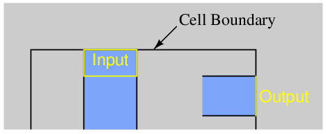
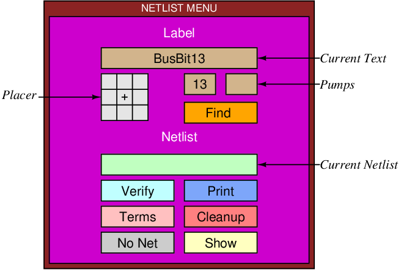
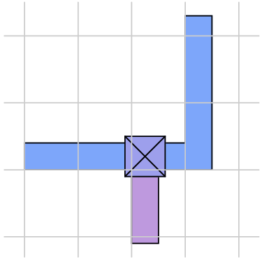

* TOC
{:toc }

Magic Tutorial \#7: Netlists and
Routing  
John Ousterhout  
Computer Science Division  
Electrical Engineering and Computer Sciences  
University of California  
Berkeley, CA 94720  
(Updated by others, too.)  
This tutorial corresponds to Magic version 7.  

Tutorials to read first:

<table class="tabbing" data-cellpadding="0" data-border="0">
<colgroup>
<col style="width: 100%" />
</colgroup>
<tbody>
<tr class="odd tabbing" style="vertical-align:baseline;">
<td class="tabbing">Magic Tutorial #1: Getting Started 
Magic Tutorial #2: Basic Painting and Selection 
Magic Tutorial #3: Advanced Painting (Wiring and Plowing) 
Magic Tutorial #4: Cell Hierarchies 
Magic Tutorial #5: Multiple Windows 
</td>
</tr>
</tbody>
</table>

Netlist Commands introduced in this
tutorial:

<table class="tabbing" data-cellpadding="0" data-border="0">
<tbody>
<tr class="odd tabbing" style="vertical-align:baseline;">
<td class="tabbing">:extract, :flush, :ripup, :savenetlist, :trace,
:writeall</td>
</tr>
</tbody>
</table>

Layout Commands introduced in this
tutorial:

<table class="tabbing" data-cellpadding="0" data-border="0">
<tbody>
<tr class="odd tabbing" style="vertical-align:baseline;">
<td class="tabbing">:channel, :route</td>
</tr>
</tbody>
</table>

Macros introduced in this tutorial:

<table class="tabbing" data-cellpadding="0" data-border="0">
<tbody>
<tr class="odd tabbing" style="vertical-align:baseline;">
<td class="tabbing">(none)</td>
</tr>
</tbody>
</table>

### 1  Introduction

This tutorial describes how to use Magic’s automatic routing tools to
make interconnections between subcells in a design. In addition to the
standard Magic router, which is invoked by the route command and covered in this
tutorial, two other routing tools are available. A gate-array router
Garouter permits user specified
channel definitions, terminals in the interior of cells, and
route-throughs across cells. To learn about the gate-array router read
this first then “Magic Tutorial \#12: Routing Gate Arrays”. Finally
Magic provides an interactive maze-router that takes graphic hints, the
Irouter, that permits the user to
control the overall path of routes while leaving the tedious details to
Magic. The Irouter is documented in
“Magic Tutorial \#10: The Interactive Router”.

The standard Magic router provides an obstacle-avoidance capability: if there
is mask material in the routing areas, the router can work under, over,
or around that material to complete the connections. This means that you
can pre-route key signals by hand and have Magic route the less
important signals automatically. In addition, you can route power and
ground by hand (right now we don’t have any power-ground routing tools,
so you have to route them by hand).

The router only makes connections
between subcells; to make point-to-point connections between pieces of
layout within a single cell you should use the wiring command described
in “Magic Tutorial \#3: Advanced Painting (Wiring and Plowing) ” or the
maze router described in “Magic Tutorial \#10: The Interactive Router”.
If you only need to make a few connections you are probably better off
doing them manually.

The first step in routing is to tell Magic what should be connected to
what. This information is contained in a file called a netlist. Sections 2, 3, 4, and 5 describe
how to create and modify netlists using Magic’s interactive netlist
editing tools. Once you’ve created a netlist, the next step is to invoke
the router. Section 6 shows how to do this, and gives a brief summary of
what goes on inside the routing tools. Unless your design is very simple
and has lots of free space, the routing probably won’t succeed the first
time. Section 7 describes the feedback provided by the routing tools.
Sections 8 and 9 discuss how you can modify your design in light of this
feedback to improve its routability. You’ll probably need to iterate a
few times until the routing is successful.

### 2  Terminals and Netlists

A netlist is a file that describes a set of desired connections. It
contains one or more nets. Each net
names a set of terminals that
should all be wired together. A terminal is simply a label attached to a
piece of mask material within a subcell; it is distinguishable from
ordinary labels within a subcell by its presence within a netlist file
and by certain characteristics common to terminals, as described below.

The first step in building a netlist is to label the terminals in your
design. Figure 1 shows an example. Each label should be a line or
rectangle running along the edge of the cell (point terminals are not
allowed). The router will make a connection to the cell somewhere along
a terminal’s length. If the label isn’t at the edge of the cell, Magic
will route recklessly across the cell to reach the terminal, taking the
shortest path between the terminal and a routing channel. It’s almost
always a good idea to arrange for terminal labels to be at cell edges.
The label must be at least as wide as the minimum width of the routing
material; the wider you make the label, the more flexibility you give
the router to choose a good point to connect to the terminal.

<figure>

<figcaption aria-hidden="true">Figure 1: An example of terminal labels. Each terminal should be
labeled with a line or rectangle along the edge of the
cell.</figcaption>
</figure>

Terminal labels must be attached to mask material that connects directly
to one of Magic’s two routing layers (Routing layers are defined in
Magic’s technology file). For example, in the SCMOS process where the
routing layers are metal1 and metal2, diffusion may not be used as a
terminal since neither of the routing layers will connect directly to
it. On the other hand, a terminal may be attached to diffusion-metal1
contact, since the metal1 routing layer will connect properly to it.
Terminals can have arbitrary names, except that they should not contain
slashes (“/”) or the substring “feedthrough”, and should not end in “@”,
“$”, or “̂”. See Tutorial \#2 for a
complete description of labeling conventions.

For an example of good and bad terminals, edit the cell tut7a. The cell doesn’t make any
electrical sense, but contains several good and bad terminals. All the
terminals with names like bad1 are
incorrect or undesirable for one of the reasons given above, and those
with names like good4 are
acceptable.

<figure>

<figcaption aria-hidden="true">Figure 2: The netlist menu.</figcaption>
</figure>

<table id="TBL-1" class="tabular" data-rules="groups">
<tbody>
<tr class="odd hline">
<td>
</td>
<td>
</td>
</tr>
<tr id="TBL-1-1-" class="even" style="vertical-align:baseline;">
<td id="TBL-1-1-1" class="td11"
style="text-align: left; white-space: nowrap;">Button</td>
<td id="TBL-1-1-2" class="td11"
style="text-align: left; white-space: nowrap;">Action</td>
</tr>
<tr class="odd hline">
<td>
</td>
<td>
</td>
</tr>
<tr id="TBL-1-2-" class="even" style="vertical-align:baseline;">
<td id="TBL-1-2-1" class="td11"
style="text-align: left; white-space: nowrap;">Current Text</td>
<td id="TBL-1-2-2" class="td11"
style="text-align: left; white-space: nowrap;">Left-click: prompt for
more labels</td>
</tr>
<tr id="TBL-1-3-" class="odd" style="vertical-align:baseline;">
<td id="TBL-1-3-1" class="td11"
style="text-align: left; white-space: nowrap;"></td>
<td id="TBL-1-3-2" class="td11"
style="text-align: left; white-space: nowrap;">Right-click: advance to
next label</td>
</tr>
<tr class="even hline">
<td>
</td>
<td>
</td>
</tr>
<tr id="TBL-1-4-" class="odd" style="vertical-align:baseline;">
<td id="TBL-1-4-1" class="td11"
style="text-align: left; white-space: nowrap;">Placer</td>
<td id="TBL-1-4-2" class="td11"
style="text-align: left; white-space: nowrap;">Left-click: place
label</td>
</tr>
<tr id="TBL-1-5-" class="even" style="vertical-align:baseline;">
<td id="TBL-1-5-1" class="td11"
style="text-align: left; white-space: nowrap;"></td>
<td id="TBL-1-5-2" class="td11"
style="text-align: left; white-space: nowrap;">Right-click: change label
text position</td>
</tr>
<tr class="odd hline">
<td>
</td>
<td>
</td>
</tr>
<tr id="TBL-1-6-" class="even" style="vertical-align:baseline;">
<td id="TBL-1-6-1" class="td11"
style="text-align: left; white-space: nowrap;">Pumps</td>
<td id="TBL-1-6-2" class="td11"
style="text-align: left; white-space: nowrap;">Left-click: decrement
number</td>
</tr>
<tr id="TBL-1-7-" class="odd" style="vertical-align:baseline;">
<td id="TBL-1-7-1" class="td11"
style="text-align: left; white-space: nowrap;"></td>
<td id="TBL-1-7-2" class="td11"
style="text-align: left; white-space: nowrap;">Right-click: increment
number</td>
</tr>
<tr class="even hline">
<td>
</td>
<td>
</td>
</tr>
<tr id="TBL-1-8-" class="odd" style="vertical-align:baseline;">
<td id="TBL-1-8-1" class="td11"
style="text-align: left; white-space: nowrap;">Find</td>
<td id="TBL-1-8-2" class="td11"
style="text-align: left; white-space: nowrap;">Search under box,
highlight labels</td>
</tr>
<tr id="TBL-1-9-" class="even" style="vertical-align:baseline;">
<td id="TBL-1-9-1" class="td11"
style="text-align: left; white-space: nowrap;"></td>
<td id="TBL-1-9-2" class="td11"
style="text-align: left; white-space: nowrap;">matching current
text</td>
</tr>
<tr class="odd hline">
<td>
</td>
<td>
</td>
</tr>
<tr id="TBL-1-10-" class="even" style="vertical-align:baseline;">
<td id="TBL-1-10-1" class="td11"
style="text-align: left; white-space: nowrap;">Current Netlist</td>
<td id="TBL-1-10-2" class="td11"
style="text-align: left; white-space: nowrap;">Left-click: prompt for
new netlist name</td>
</tr>
<tr id="TBL-1-11-" class="odd" style="vertical-align:baseline;">
<td id="TBL-1-11-1" class="td11"
style="text-align: left; white-space: nowrap;"></td>
<td id="TBL-1-11-2" class="td11"
style="text-align: left; white-space: nowrap;">Right-click: use edit
cell name as netlist name</td>
</tr>
<tr class="even hline">
<td>
</td>
<td>
</td>
</tr>
<tr id="TBL-1-12-" class="odd" style="vertical-align:baseline;">
<td id="TBL-1-12-1" class="td11"
style="text-align: left; white-space: nowrap;">Verify</td>
<td id="TBL-1-12-2" class="td11"
style="text-align: left; white-space: nowrap;">Check that wiring matches
netlist (same as</td>
</tr>
<tr id="TBL-1-13-" class="even" style="vertical-align:baseline;">
<td id="TBL-1-13-1" class="td11"
style="text-align: left; white-space: nowrap;"></td>
<td id="TBL-1-13-2" class="td11"
style="text-align: left; white-space: nowrap;">typing :verify command)</td>
</tr>
<tr class="odd hline">
<td>
</td>
<td>
</td>
</tr>
<tr id="TBL-1-14-" class="even" style="vertical-align:baseline;">
<td id="TBL-1-14-1" class="td11"
style="text-align: left; white-space: nowrap;">Print</td>
<td id="TBL-1-14-2" class="td11"
style="text-align: left; white-space: nowrap;">Print names of all
terminals in selected net</td>
</tr>
<tr id="TBL-1-15-" class="odd" style="vertical-align:baseline;">
<td id="TBL-1-15-1" class="td11"
style="text-align: left; white-space: nowrap;"></td>
<td id="TBL-1-15-2" class="td11"
style="text-align: left; white-space: nowrap;">(same as typing :print command)</td>
</tr>
<tr class="even hline">
<td>
</td>
<td>
</td>
</tr>
<tr id="TBL-1-16-" class="odd" style="vertical-align:baseline;">
<td id="TBL-1-16-1" class="td11"
style="text-align: left; white-space: nowrap;">Terms</td>
<td id="TBL-1-16-2" class="td11"
style="text-align: left; white-space: nowrap;">Place feedback areas on
screen to identify all terminals</td>
</tr>
<tr id="TBL-1-17-" class="even" style="vertical-align:baseline;">
<td id="TBL-1-17-1" class="td11"
style="text-align: left; white-space: nowrap;"></td>
<td id="TBL-1-17-2" class="td11"
style="text-align: left; white-space: nowrap;">in current netlist (same
as :showterms command)</td>
</tr>
<tr class="odd hline">
<td>
</td>
<td>
</td>
</tr>
<tr id="TBL-1-18-" class="even" style="vertical-align:baseline;">
<td id="TBL-1-18-1" class="td11"
style="text-align: left; white-space: nowrap;">Cleanup</td>
<td id="TBL-1-18-2" class="td11"
style="text-align: left; white-space: nowrap;">Check current netlist for
missing labels and nets</td>
</tr>
<tr id="TBL-1-19-" class="odd" style="vertical-align:baseline;">
<td id="TBL-1-19-1" class="td11"
style="text-align: left; white-space: nowrap;"></td>
<td id="TBL-1-19-2" class="td11"
style="text-align: left; white-space: nowrap;">with less than two
terminals (same as typing</td>
</tr>
<tr class="even hline">
<td>
</td>
<td>
</td>
</tr>
<tr id="TBL-1-20-" class="odd" style="vertical-align:baseline;">
<td id="TBL-1-20-1" class="td11"
style="text-align: left; white-space: nowrap;"></td>
<td id="TBL-1-20-2" class="td11"
style="text-align: left; white-space: nowrap;">:cleanup command)</td>
</tr>
<tr id="TBL-1-21-" class="even" style="vertical-align:baseline;">
<td id="TBL-1-21-1" class="td11"
style="text-align: left; white-space: nowrap;">No Net</td>
<td id="TBL-1-21-2" class="td11"
style="text-align: left; white-space: nowrap;">Delete selected net (same
as :dnet command)</td>
</tr>
<tr class="odd hline">
<td>
</td>
<td>
</td>
</tr>
<tr id="TBL-1-22-" class="even" style="vertical-align:baseline;">
<td id="TBL-1-22-1" class="td11"
style="text-align: left; white-space: nowrap;">Show</td>
<td id="TBL-1-22-2" class="td11"
style="text-align: left; white-space: nowrap;">Highlight paint connected
to material under box</td>
</tr>
<tr id="TBL-1-23-" class="odd" style="vertical-align:baseline;">
<td id="TBL-1-23-1" class="td11"
style="text-align: left; white-space: nowrap;"></td>
<td id="TBL-1-23-2" class="td11"
style="text-align: left; white-space: nowrap;">(same as typing :shownet command)</td>
</tr>
<tr class="even hline">
<td>
</td>
<td>
</td>
</tr>
<tr id="TBL-1-24-" class="odd" style="vertical-align:baseline;">
<td id="TBL-1-24-1" class="td11"
style="text-align: left; white-space: nowrap;"></td>
<td></td>
</tr>
</tbody>
</table>

Table 1: A summary of all
the netlist menu button actions.

If you create two or more terminal labels with the same name in the same
cell the router will assume that they are electrically equivalent
(connected together within the cell). Because of this, when routing the
net it will feel free to connect to whichever one of the terminals is
most convenient, and ignore the others. In some cases the router may
take advantage of electrically equivalent terminals by using feed throughs: entering a cell at one
terminal to make one connection, and exiting through an equivalent
terminal on the way to make another connection for the same net.

### 3  Menu for Label Editing

Magic provides a special menu facility to assist you in placing terminal
labels and editing netlists. To make the menu appear, invoke the Magic
command

<table class="tabbing" data-cellpadding="0" data-border="0">
<tbody>
<tr class="odd tabbing" style="vertical-align:baseline;">
<td class="tabbing">:specialopen
netlist</td>
</tr>
</tbody>
</table>

A new window will appear in the lower-left corner of the screen,
containing several rectangular areas on a purple background. Each of the
rectangular areas is called a button. Clicking mouse buttons inside the
menu buttons will invoke various commands to edit labels and netlists.
Figure 2 shows a diagram of the netlist menu and Table I summarizes the
meaning of button clicks in various menu items. The netlist menu can be
grown, shrunk, and moved just like any other window; see “Magic Tutorial
\#5: Multiple Windows” for details. It also has its own private set of
commands. To see what commands you can type in the netlist menu, move
the cursor over the menu and type

<table class="tabbing" data-cellpadding="0" data-border="0">
<tbody>
<tr class="odd tabbing" style="vertical-align:baseline;">
<td class="tabbing">:help</td>
</tr>
</tbody>
</table>

You shouldn’t need to type commands in the netlist menu very often,
since almost everything you’ll need to do can be done using the menu.
See Section 9 for a description of a few of the commands you can type;
the complete set is described in the manual page magic(1). One of the best uses for the
commands is so that you can define macros for them and avoid having to
go back and forth to the menu; look up the :send command in the man page to see how
to do this. The top half of the menu is for placing labels and the
bottom half is for editing netlists. This section describes the label
facilities, and Section 4 describes the netlist facilities.

The label menu makes it easy for you to enter lots of labels,
particularly when there are many labels that are the same except for a
number, e.g. bus1, bus2, bus3, etc. There are four sections to the
label menu: the current text, the placer, two pumps, and the Find button. To place labels, first click
the left mouse button over the current text rectangle. Then type one or
more labels on the keyboard, one per line. You can use this mechanism to
enter several labels at once. Type return twice to signal the end of the
list. At this point, the first of the labels you typed will appear in
the current text rectangle.

To place a label, position the box over the area you want to label, then
click the left mouse button inside one of the squares of the placer
area. A label will be created with the current text. Where you click in
the placer determines where the label text will appear relative to the
label box: for example, clicking the left-center square causes the text
to be centered just to the left of the box. You can place many copies of
the same label by moving the box and clicking the placer area again. You
can re-orient the text of a label by clicking the right mouse button
inside the placer area. For example, if you would like to move a label’s
text so that it appears centered above the label, place the box over the
label and right-click the top-center placer square.

If you entered several labels at once, only the first appears in the
current text area. However, you can advance to the next label by
right-clicking inside the current text area. In this way you can place a
long series of labels entirely with the mouse. Try using this mechanism
to add labels to tut7a.

The two small buttons underneath the right side of the current text area
are called pumps. To see how these work, enter a label name containing a
number into the current text area, for example, bus1. When you do this, the “1” appears in
the left pump. Right-clicking the pump causes the number to increment,
and left-clicking the pump causes the number to decrement. This makes it
easy for you to enter a series of numbered signal names. If a name has
two numbers in it, the second number will appear in the second pump, and
it can be incremented or decremented too. Try using the pumps to place a
series of numbered names.

The last entry in the label portion of the menu is the Find button. This can be used to locate a
label by searching for a given pattern. If you click the Find button, Magic will use the current
text as a pattern and search the area underneath the box for a label
whose name contains the pattern. Pattern-matching is done in the same
way as in csh, using the special
characters “\*”, “?”, “  
”, “\[”, and “\]”. Try this on tut7a: enter “good\*” into the current
text area, place the box around the whole cell, then click on the “Find”
button. For each of the good labels, a feedback area will be created
with white stripes to highlight the area. The :feedback find command can be used to step
through the areas, and :feedback clear
will erase the feedback information from the screen. The :feedback command has many of the same
options as :drc for getting
information about feedback areas; see the Magic manual page for details,
or type :feedback help for a
synopsis of the options.

### 4  Netlist Editing

After placing terminal labels, the next step is to specify the
connections between them; this is called netlist editing. The bottom
half of the netlist menu is used for editing netlists. The first thing
you must do is to specify the netlist you want to edit. Do this by
clicking in the current netlist box. If you left-click, Magic will
prompt you for the netlist name and you can type it at the keyboard. If
you right-click, Magic will use the name of the edit cell as the current
netlist name. In either case, Magic will read the netlist from disk if
it exists and will create a new netlist if there isn’t currently a
netlist file with the given name. Netlist files are stored on disk with
a “.net” extension, which is added by Magic when it reads and writes
files. You can change the current netlist by clicking the current
netlist button again. Startup Magic on the cell tut7b, open the netlist menu, and set the
current netlist to tut7b. Then
expand the subcells in tut7b so that
you can see their terminals.

<table id="TBL-2" class="tabular" data-rules="groups">
<tbody>
<tr class="odd hline">
<td>
</td>
<td>
</td>
</tr>
<tr id="TBL-2-1-" class="even" style="vertical-align:baseline;">
<td id="TBL-2-1-1" class="td11"
style="text-align: left; white-space: nowrap;">Button</td>
<td id="TBL-2-1-2" class="td11"
style="text-align: left; white-space: nowrap;">Action</td>
</tr>
<tr class="odd hline">
<td>
</td>
<td>
</td>
</tr>
<tr id="TBL-2-2-" class="even" style="vertical-align:baseline;">
<td id="TBL-2-2-1" class="td11"
style="text-align: left; white-space: nowrap;">Left</td>
<td id="TBL-2-2-2" class="td11"
style="text-align: left; white-space: nowrap;">Select net, using nearest
terminal to cursor.</td>
</tr>
<tr class="odd hline">
<td>
</td>
<td>
</td>
</tr>
<tr id="TBL-2-3-" class="even" style="vertical-align:baseline;">
<td id="TBL-2-3-1" class="td11"
style="text-align: left; white-space: nowrap;">Right</td>
<td id="TBL-2-3-2" class="td11"
style="text-align: left; white-space: nowrap;">Toggle nearest terminal
into or out of</td>
</tr>
<tr id="TBL-2-4-" class="odd" style="vertical-align:baseline;">
<td id="TBL-2-4-1" class="td11"
style="text-align: left; white-space: nowrap;"></td>
<td id="TBL-2-4-2" class="td11"
style="text-align: left; white-space: nowrap;">current net.</td>
</tr>
<tr class="even hline">
<td>
</td>
<td>
</td>
</tr>
<tr id="TBL-2-5-" class="odd" style="vertical-align:baseline;">
<td id="TBL-2-5-1" class="td11"
style="text-align: left; white-space: nowrap;">Middle</td>
<td id="TBL-2-5-2" class="td11"
style="text-align: left; white-space: nowrap;">Find nearest terminal,
join its net with the</td>
</tr>
<tr id="TBL-2-6-" class="even" style="vertical-align:baseline;">
<td id="TBL-2-6-1" class="td11"
style="text-align: left; white-space: nowrap;"></td>
<td id="TBL-2-6-2" class="td11"
style="text-align: left; white-space: nowrap;">current net.</td>
</tr>
<tr class="odd hline">
<td>
</td>
<td>
</td>
</tr>
<tr id="TBL-2-7-" class="even" style="vertical-align:baseline;">
<td id="TBL-2-7-1" class="td11"
style="text-align: left; white-space: nowrap;"></td>
<td></td>
</tr>
</tbody>
</table>

Table 2: The actions of
the mouse buttons when the terminal tool is in use.

Netlist editing is done with the netlist tool. If you haven’t already
read “Tutorial \#3: Advanced Painting (Wiring and Plowing)”, you should
read it now, up through Section 2.1. Tutorial \#3 explained how to
change the current tool by using the space macro or by typing :tool. Switch tools to the netlist tool
(the cursor will appear as a thick square).

When the netlist tool is in use the left, right, and middle buttons
invoke select, toggle, and join operations respectively (see Table II).
To see how they work, move the cursor over the terminal right4 in the top subcell of tut7b and click the left mouse button (you
may have to zoom in a bit to see the labels; terminals are numbered in
clockwise order: right4 is the
fourth terminal from the top on the right side). This causes the net
containing that terminal to be selected. Three hollow white squares will
appear over the layout, marking the terminals that are supposed to be
wired together into right4’s net.
Left-click over the left3 terminal
in the same subcell to select its net, then select the right4 net again.

The right button is used to toggle terminals into or out of the current
net. If you right-click over a terminal that is in the current net, then
it is removed from the current net. If you right-click over a terminal
that isn’t in the current net, it is added to the current net. A single
terminal can only be in one net at a time, so if a terminal is already
in a net when you toggle it into another net then Magic will remove it
from the old net. Toggle the terminal top4
in the bottom cell out of, then back into, the net containing
right4. Now toggle left3 in the bottom cell into this net.
Magic warns you because it had to remove left3 from another net in order to add it
to right4’s net. Type u to undo this change, then left-click on
left3 to make sure it got restored
to its old net by the undo. All of the netlist-editing operations are
undo-able.

The middle button is used to merge two nets together. If you
middle-click over a terminal, all the terminals in its net are added to
the current net. Play around with the three buttons to edit the netlist
tut7b.

Note: the router does not make connections to terminals in the top level
cell. It only works with terminals in subcells, or sub-subcells, etc.
Because of this, the netlist editor does not permit you to select
terminals in the top level cell. If you click over such a terminal Magic
prints an error message and refuses to make the selection.

If you left-click over a terminal that is not currently in a net, Magic
creates a new net automatically. If you didn’t really want to make a new
net, you have several choices. Either you can toggle the terminal out of
its own net, you can undo the select operation, or you can click the
No Net button in the netlist menu
(you can do this even while the cursor is in the square shape). The
No Net button removes all terminals
from the current net and destroys the net. It’s a bad idea to leave
single-net terminals in the netlist: the router will treat them as
errors.

There are two ways to save netlists on disk; these are similar to the
ways you can save layout cells. If you type

<table class="tabbing" data-cellpadding="0" data-border="0">
<tbody>
<tr class="odd tabbing" style="vertical-align:baseline;">
<td class="tabbing">:savenetlist
[name]</td>
</tr>
</tbody>
</table>

with the cursor over the netlist menu, the current netlist will be saved
on disk in the file name.net. If no name is typed, the name of the current
netlist is used. If you type the command

<table class="tabbing" data-cellpadding="0" data-border="0">
<tbody>
<tr class="odd tabbing" style="vertical-align:baseline;">
<td class="tabbing">:writeall</td>
</tr>
</tbody>
</table>

then Magic will step through all the netlists that have been modified
since they were last written, asking you if you’d like them to be
written out. If you try to leave Magic without saving all the modified
netlists, Magic will warn you and give you a chance to write them out.

If you make changes to a netlist and then decide you don’t want them,
you can use the :flush netlist
command to throw away all of the changes and re-read the netlist from
its disk file. If you create netlists using a text editor or some other
program, you can use :flush after
you’ve modified the netlist file in order to make sure that Magic is
using the most up-to-date version.

The Print button in the netlist menu
will print out on the text screen the names of all the terminals in the
current net. Try this for some of the nets in tut7b. The official name of a terminal
looks a lot like a Unix file name, consisting of a bunch of fields
separated by slashes. Each field except the last is the id of a subcell,
and the last field is the name of the terminal. These hierarchical names
provide unique names for each terminal, even if the same terminal name
is re-used in different cells or if there are multiple copies of the
same cell.

The Verify button will check the
paint of the edit cell to be sure it implements the connections
specified in the current netlist. Feedback areas are created to show
nets that are incomplete or nets that are shorted together.

The Terms button will cause Magic to
generate a feedback area over each of the terminals in the current
netlist, so that you can see which terminals are included in the
netlist. If you type the command :feedback
clear in a layout window then the feedback will be erased.

The Cleanup button is there as a
convenience to help you cleanup your netlists. If you click on it, Magic
will scan through the current netlist to make sure it is reasonable.
Cleanup looks for two error
conditions: terminal names that don’t correspond to any labels in the
design, and nets that don’t have at least two terminals. When it finds
either of these conditions it prints a message and gives you the chance
to either delete the offending terminal (if you type dterm), delete the offending net (dnet), skip the current problem without
modifying the netlist and continue looking for other problems (skip), or abort the Cleanup command without making any more
changes (abort).

The Show button provides an
additional mechanism for displaying the paint in the net. If you place
the box over a piece of paint and click on Show, Magic will highlight all of the
paint in the net under the box. This is similar to pointing at the net
and typing s three times to select
the net, except that Show doesn’t
select the net (it uses a different mechanism to highlight it), and
Show will trace through all cells,
expanded or not (the selection mechanism only considers paint in
expanded cells). Once you’ve used Show
to highlight a net, the only way to make the highlighting go away
is to place the box over empty space and invoke Show again. Show is an old command that pre-dates the
selection interface, but we’ve left it in Magic because some people find
it useful.

### 5  Netlist Files

Netlists are stored on disk in ordinary text files. You are welcome to
edit those files by hand or to write programs that generate the netlists
automatically. For example, a netlist might be generated by a schematic
editor or by a high-level simulator. See the manual page net(5) for a description of netlist file
format.

### 6  Running the Router

Once you’ve created a netlist, it is relatively easy to invoke the
router. First, place the box around the area you’d like Magic to
consider for routing. No terminals outside this area will be considered,
and Magic will not generate any paint more than a few units outside this
area (Magic may use the next routing grid line outside the area). Load
tut7d, :flush the netlist if you made any changes
to it, set the box to the bounding box of the cell, and then invoke the
router using the command:

<table class="tabbing" data-cellpadding="0" data-border="0">
<tbody>
<tr class="odd tabbing" style="vertical-align:baseline;">
<td class="tabbing">:route</td>
</tr>
</tbody>
</table>

When the command completes, the netlist should be routed. Click the
Verify netlist button to make sure
the connections were made correctly. Try deleting a piece from one of
the wires and verify again. Feedback areas should appear to indicate
where the routing was incorrect. Use the :feedback command to step through the
areas and, eventually, to delete the feedback (:feedback help gives a synopsis of the
command options).

If the router is unable to complete the connections, it will report
errors to you. Errors may be reported in several ways. For some errors,
such as non-existent terminal names, messages will be printed. For other
errors, cross-hatched feedback areas will be created. Most of the
feedback areas have messages similar to “Net shifter/bit\[0\]/phi1:
Can’t make bottom connection.” To see the message associated with a
feedback area, place the box over the feedback area and type :feedback why. In this case the message
means that for some reason the router was unable to connect the
specified net (named by one of its terminals) within one of the routing
channel. The terms “bottom”, “top”, etc. may be misnomers because Magic
sometimes rotates channels before routing: the names refer to the
direction at the time the channel was routed, not the direction in the
circuit. However, the location of the feedback area indicates where the
connection was supposed to have been made.

You’ve probably noticed by now that the router sometimes generates
unnecessary wiring, such as inserting extra jogs and U-shapes in wires
(look next to right3 in the top
cell). These jogs are particularly noticeable in small examples.
However, the router actually does better
on larger examples: there will still be a bit of extra wire, but
it’s negligible in comparison to the total wire length on a large chip.
Some of this wire is necessary and important: it helps the router to
avoid several problem situations that would cause it to fail on more
difficult examples. However, you can use the straighten command described in “Magic
Tutorial \#3: Advanced Painting (Wiring and Plowing)” to remove
unnecessary jogs. Please don’t judge the router by its behavior on small
examples. On the other hand, if it does awful things on big examples,
we’d like to know about it.

All of the wires placed by the router are of the same width, so the
router won’t be very useful for power and ground wiring.

When using the Magic router, you can wire power and ground by hand
before running the router. The router will be able to work around your
hand-placed connections to make the connections in the netlist. If there
are certain key signals that you want to wire carefully by hand, you can
do this too; the router will work around them. Signals that you route by
hand should not be in the netlist. Tutorial7b has an example of “hand
routing” in the form of a piece of metal in the middle of the circuit.
Undo the routing, and try modifying the metal and/or adding more hand
routing of your own to see how it affects the routing.

The Magic router has a number of options useful for getting information
about the routing and setting routing parameters. You need to invoke the
route command once for each option
you want to specify; then type :route
with no options to start up the router with whatever parameters
you’ve set. The viamin, option which
invokes a routing post-pass is, of course, invoked AFTER routing. Type
:route netlist file to specify a netlist for the routing
without having to open up the netlist menu. The metal option lets you toggle metal
maximization on and off; if metal maximization is turned on, the router
converts routing from the alternate routing layer (“poly”) to the
preferred routing layer (“metal”) wherever possible. The vias option controls metal maximization by
specifying how many grid units of “metal” conversion make it worthwhile
to place vias; setting this to 5 means that metal maximization will add
extra vias only if 5 or more grid units of “poly” can be converted to
“metal”. View the current technology’s router parameters with the tech option. The jog, obstacle, and steady options let you view and change
parameters to control the channel router (this feature is for advanced
users). The viamin option invokes a
via minimization algorithm which reduces the number of vias in a routed
layout. This can be used as a post-processing step to improve the
quality of the routing. This may be useful even when using another
router to do the actual routing. Finally, show all parameter values with
the settings option. The options and
their actions are summarized in Table III.

<table id="TBL-3" class="tabular" data-rules="groups">
<tbody>
<tr class="odd hline">
<td>
</td>
<td>
</td>
</tr>
<tr id="TBL-3-1-" class="even" style="vertical-align:baseline;">
<td id="TBL-3-1-1" class="td11"
style="text-align: left; white-space: nowrap;">Option</td>
<td id="TBL-3-1-2" class="td11"
style="text-align: left; white-space: nowrap;">Action</td>
</tr>
<tr class="odd hline">
<td>
</td>
<td>
</td>
</tr>
<tr id="TBL-3-2-" class="even" style="vertical-align:baseline;">
<td id="TBL-3-2-1" class="td11"
style="text-align: left; white-space: nowrap;">end </td>
<td id="TBL-3-2-2" class="td11"
style="text-align: left; white-space: nowrap;">Print the channel router
end constant</td>
</tr>
<tr id="TBL-3-3-" class="odd" style="vertical-align:baseline;">
<td id="TBL-3-3-1" class="td11"
style="text-align: left; white-space: nowrap;">endreal
</td>
<td id="TBL-3-3-2" class="td11"
style="text-align: left; white-space: nowrap;">Set the channel router
end constant</td>
</tr>
<tr class="even hline">
<td>
</td>
<td>
</td>
</tr>
<tr id="TBL-3-4-" class="odd" style="vertical-align:baseline;">
<td id="TBL-3-4-1" class="td11"
style="text-align: left; white-space: nowrap;">help </td>
<td id="TBL-3-4-2" class="td11"
style="text-align: left; white-space: nowrap;">Print a summary of the
router options</td>
</tr>
<tr class="even hline">
<td>
</td>
<td>
</td>
</tr>
<tr id="TBL-3-5-" class="odd" style="vertical-align:baseline;">
<td id="TBL-3-5-1" class="td11"
style="text-align: left; white-space: nowrap;">jog </td>
<td id="TBL-3-5-2" class="td11"
style="text-align: left; white-space: nowrap;">Print the channel router
minimum jog length</td>
</tr>
<tr id="TBL-3-6-" class="even" style="vertical-align:baseline;">
<td id="TBL-3-6-1" class="td11"
style="text-align: left; white-space: nowrap;">jog int
</td>
<td id="TBL-3-6-2" class="td11"
style="text-align: left; white-space: nowrap;">Set the minimum jog
length, measured in grid units</td>
</tr>
<tr class="odd hline">
<td>
</td>
<td>
</td>
</tr>
<tr id="TBL-3-7-" class="even" style="vertical-align:baseline;">
<td id="TBL-3-7-1" class="td11"
style="text-align: left; white-space: nowrap;">metal </td>
<td id="TBL-3-7-2" class="td11"
style="text-align: left; white-space: nowrap;">Toggle metal maximization
on or off</td>
</tr>
<tr class="odd hline">
<td>
</td>
<td>
</td>
</tr>
<tr id="TBL-3-8-" class="even" style="vertical-align:baseline;">
<td id="TBL-3-8-1" class="td11"
style="text-align: left; white-space: nowrap;">netlist </td>
<td id="TBL-3-8-2" class="td11"
style="text-align: left; white-space: nowrap;">Print the name of the
current net list</td>
</tr>
<tr id="TBL-3-9-" class="odd" style="vertical-align:baseline;">
<td id="TBL-3-9-1" class="td11"
style="text-align: left; white-space: nowrap;">netlist file
</td>
<td id="TBL-3-9-2" class="td11"
style="text-align: left; white-space: nowrap;">Set the current net
list</td>
</tr>
<tr class="even hline">
<td>
</td>
<td>
</td>
</tr>
<tr id="TBL-3-10-" class="odd" style="vertical-align:baseline;">
<td id="TBL-3-10-1" class="td11"
style="text-align: left; white-space: nowrap;">obstacle </td>
<td id="TBL-3-10-2" class="td11"
style="text-align: left; white-space: nowrap;">Print the channel router
obstacle constant</td>
</tr>
<tr id="TBL-3-11-" class="even" style="vertical-align:baseline;">
<td id="TBL-3-11-1" class="td11"
style="text-align: left; white-space: nowrap;">obstacle real</td>
<td id="TBL-3-11-2" class="td11"
style="text-align: left; white-space: nowrap;">Set the obstacle
constant</td>
</tr>
<tr class="odd hline">
<td>
</td>
<td>
</td>
</tr>
<tr id="TBL-3-12-" class="even" style="vertical-align:baseline;">
<td id="TBL-3-12-1" class="td11"
style="text-align: left; white-space: nowrap;">settings </td>
<td id="TBL-3-12-2" class="td11"
style="text-align: left; white-space: nowrap;">Print a list of all
router parameters</td>
</tr>
<tr class="odd hline">
<td>
</td>
<td>
</td>
</tr>
<tr id="TBL-3-13-" class="even" style="vertical-align:baseline;">
<td id="TBL-3-13-1" class="td11"
style="text-align: left; white-space: nowrap;">steady </td>
<td id="TBL-3-13-2" class="td11"
style="text-align: left; white-space: nowrap;">Print the channel router
steady net constant</td>
</tr>
<tr id="TBL-3-14-" class="odd" style="vertical-align:baseline;">
<td id="TBL-3-14-1" class="td11"
style="text-align: left; white-space: nowrap;">steady int
</td>
<td id="TBL-3-14-2" class="td11"
style="text-align: left; white-space: nowrap;">Set the steady net
constant, measured in grid units</td>
</tr>
<tr class="even hline">
<td>
</td>
<td>
</td>
</tr>
<tr id="TBL-3-15-" class="odd" style="vertical-align:baseline;">
<td id="TBL-3-15-1" class="td11"
style="text-align: left; white-space: nowrap;">tech </td>
<td id="TBL-3-15-2" class="td11"
style="text-align: left; white-space: nowrap;">Print router technology
information</td>
</tr>
<tr class="even hline">
<td>
</td>
<td>
</td>
</tr>
<tr id="TBL-3-16-" class="odd" style="vertical-align:baseline;">
<td id="TBL-3-16-1" class="td11"
style="text-align: left; white-space: nowrap;">vias </td>
<td id="TBL-3-16-2" class="td11"
style="text-align: left; white-space: nowrap;">Print the metal
maximization via limit</td>
</tr>
<tr id="TBL-3-17-" class="even" style="vertical-align:baseline;">
<td id="TBL-3-17-1" class="td11"
style="text-align: left; white-space: nowrap;">vias int
</td>
<td id="TBL-3-17-2" class="td11"
style="text-align: left; white-space: nowrap;">Set the via limit</td>
</tr>
<tr class="odd hline">
<td>
</td>
<td>
</td>
</tr>
<tr id="TBL-3-18-" class="even" style="vertical-align:baseline;">
<td id="TBL-3-18-1" class="td11"
style="text-align: left; white-space: nowrap;">viamin </td>
<td id="TBL-3-18-2" class="td11"
style="text-align: left; white-space: nowrap;">Minimize vias in a routed
layout.</td>
</tr>
<tr class="odd hline">
<td>
</td>
<td>
</td>
</tr>
<tr id="TBL-3-19-" class="even" style="vertical-align:baseline;">
<td id="TBL-3-19-1" class="td11"
style="text-align: left; white-space: nowrap;"></td>
<td></td>
</tr>
</tbody>
</table>

Table 3: A summary of all
of Magic router options.

### 7  How the Router Works

In order to make the router produce the best possible results, it helps
to know a little bit about how it works. The router runs in three
stages, called channel definition,
global routing, and channel routing. In the channel
definition phase, Magic divides the area of the edit cell into
rectangular routing areas called channels. The channels cover all the
space under the box except the areas occupied by subcells. All of
Magic’s routing goes in the channel areas, except that stems (Section
8.2) may extend over subcells.

To see the channel structure that Magic chose, place the box in tut7d as if you were going to route, then
type the command

<table class="tabbing" data-cellpadding="0" data-border="0">
<tbody>
<tr class="odd tabbing" style="vertical-align:baseline;">
<td class="tabbing">:channel</td>
</tr>
</tbody>
</table>

in the layout window. Magic will compute the channel structure and
display it on the screen as a collection of feedback areas. The channel
structure is displayed as white rectangles. Type :feedback clear when you’re through
looking at them.

The second phase of routing is global routing. In the global routing
phase, Magic considers each net in turn and chooses the sequence of
channels the net must pass through in order to connect its terminals.
The crossing points (places where
the net crosses from one channel to another) are chosen at this point,
but not the exact path through each channel.

In the third phase, each channel is considered separately. All the nets
passing through that channel are examined at once, and the exact path of
each net is decided. Once the routing paths have been determined, paint
is added to the edit cell to implement the routing.

The router is grid-based: all wires are placed on a uniform grid. For
the standard nMOS process the grid spacing is 7 units, and for the
standard SCMOS process it is 8 units. If you type :grid 8 after routing tut7b, you’ll see that all of the routing
lines up with its lower and left sides on grid lines. Fortunately, you
don’t have to make your cell terminals line up on even grid boundaries.
During the routing Magic generates stems
that connect your terminals up to grid lines at the edges of
channels. Notice that there’s space left by Magic between the subcells
and the channels; this space is used by the stem generator.

### 8  What to do When the Router Fails

Don’t be surprised if the router is unable to make all the connections
the first time you try it on a large circuit. Unless you have extra
routing space in your chip, you may have to make slight re-arrangements
to help the router out. The paragraphs below describe things you can do
to make life easier for the router. This section is not very well
developed, so we’d like to hear about techniques you use to improve
routability. If you discover new techniques, send us mail and we’ll add
them to this section.

#### 8.1  Channel Structure

One of the first things to check when the router fails is the channel
structure. If using the Magic router, type :channel to look at the channels. One
common mistake is to have some of the desired routing area covered by
subcells; Magic only runs wires where there are no subcells. Check to be
sure that there are channels everywhere that you’re expecting wires to
run. If you place cells too close together, there may not be enough room
to have a channel between the cells; when this happens Magic will route
willy-nilly across the tops of cells to bring terminals out to channels,
and will probably generate shorts or design-rule violations. To solve
the problem, move the cells farther apart. If there are many skinny
channels, it will be difficult for the router to produce good routing.
Try to re-arrange the cell structure to line up edges of nearby cells so
that there are as few channels as possible and they are as large as
possible (before doing this you’ll probably want to get rid of the
existing routing by undo-ing or by flushing the edit cell).

#### 8.2  Stems

Another problem has to do with the stem generator. Stems are the pieces
of wiring that connect terminals up to grid points on the edges of
channels. The current stem generation code doesn’t know about
connectivity or design rules. It simply finds the nearest routing grid
point and wires out to that point, without considering any other
terminals. If a terminal is not on the edge of the cell, the stem runs
straight across the cell to the nearest channel, without any
consideration for other material in the cell. If two terminals are too
close together, Magic may decide to route them both to the same grid
point. When this happens, you have two choices. Either you can move the
cell so that the terminals have different nearest grid points (for
example, you can line its terminals up with the grid lines), or if this
doesn’t work you’ll have to modify the cell to make the terminals
farther apart.

The place where stems cause the most trouble is in PLAs, many of which
have been optimized to space the outputs as closely together as
possible. In some cases the outputs are closer together than the routing
grid, which is an impossible situation for the stem generator. In this
case, we think the best approach is to change the PLA templates to space
the outputs farther apart. Either space them exactly the same as the
router grid (in which case you can line the PLAs up before routing so
the terminals are already on the grid), or space the outputs at least
1.5 grid units apart so the stem generator won’t have troubles. Having
tightly-spaced PLA outputs is false economy: it makes it more difficult
to design the PLAs and results in awful routing problems. Even if Magic
could river-route out from tightly-spaced terminals to grid lines (which
it can’t), it would require *N*2 space to route out *N*
lines; it takes less area to stretch the PLA.

#### 8.3  Obstacles

The router tends to have special difficulties with obstacles running
along the edges of channels. When you’ve placed a power wire or other
hand-routing along the edge of a channel, the channel router will often
run material under your wiring in the other routing layer, thereby
blocking both routing layers and making it impossible to complete the
routing. Where this occurs, you can increase the chances of successful
routing by moving the hand-routing away from the channel edges. It’s
especially important to keep hand-routing away from terminals. The stem
generator will not pay any attention to hand-routing when it generates
stems (it just makes a bee-line for the nearest grid point), so it may
accidentally short a terminal to nearby hand-routing.

<figure>

<figcaption aria-hidden="true">Figure 3: When placing hand routing, it is best to place wires
with their left and bottom edges along grid lines, and contacts centered
on the wires. In this fashion, the hand routing will block as few
routing grid lines as possible.</figcaption>
</figure>

When placing hand-routing, you can get better routing results by
following the advice illustrated in Figure 3. First, display the routing
grid. For example, if the router is using a 8-unit grid (which is true
for the standard SCMOS technology), type :grid 8. Then place all your hand routing
with its left and bottom edges along the grid lines. Because of the way
the routing tools work, this approach results in the least possible
amount of lost routing space.

### 9  More Netlist Commands

In addition to the netlist menu buttons and commands described in
Section 4, there are a number of other netlist commands you can invoke
by typing in the netlist window. Many of these commands are textual
equivalents of the menu buttons. However, they allow you to deal with
terminals by typing the hierarchical name of the terminal rather than by
pointing to it. If you don’t know where a terminal is, or if you have
deleted a label from your design so that there’s nothing to point to,
you’ll have to use the textual commands. Commands that don’t just
duplicate menu buttons are described below; see the magic(1) manual page for details on the
others.

The netlist command

<table class="tabbing" data-cellpadding="0" data-border="0">
<tbody>
<tr class="odd tabbing" style="vertical-align:baseline;">
<td class="tabbing">:extract</td>
</tr>
</tbody>
</table>

will generate a net from existing wiring. It looks under the box for
paint, then traces out all the material in the edit cell that is
connected electrically to that paint. Wherever the material touches
subcells it looks for terminals in the subcells, and all the terminals
it finds are placed into a new net. Warning: there is also an extract command for layout windows, and it
is totally different from the extract
command in netlist windows. Make sure you’ve got the cursor over
the netlist window when you invoke this command!

The netlist editor provides two commands for ripping up existing routing
(or other material). They are

<table class="tabbing" data-cellpadding="0" data-border="0">
<colgroup>
<col style="width: 100%" />
</colgroup>
<tbody>
<tr class="odd tabbing" style="vertical-align:baseline;">
<td class="tabbing">:ripup 
:ripup netlist</td>
</tr>
</tbody>
</table>

The first command starts by finding any paint in the edit cell that lies
underneath the box. It then works outward from that paint to find all
paint in the edit cell that is electrically connected to the starting
paint. All of this paint is erased. (:ripup
isn’t really necessary, since the same effect can be achieved by
selecting all the paint in the net and deleting the selection; it’s a
hangover from olden days when there was no selection). The second form
of the command, :ripup netlist, is
similar to the first except that it starts from each of the terminals in
the current netlist instead of the box. Any paint in the edit cell that
is electrically connected to a terminal is erased. The :ripup netlist command may be useful to
ripup existing routing before rerouting.

The command

<table class="tabbing" data-cellpadding="0" data-border="0">
<tbody>
<tr class="odd tabbing" style="vertical-align:baseline;">
<td class="tabbing">:trace [name]</td>
</tr>
</tbody>
</table>

provides an additional facility for examining router feedback. It
highlights all paint connected to each terminal in the net containing
name, much as the Show menu button does for paint connected
to anything under the box. The net to be highlighted may be specified by
naming one of its terminals, for example, :trace shifter/bit\[0\]/phi1. Use the
trace command in conjunction with the nets specified in router feedback
to see the partially completed wiring for a net. Where no net is
specified, the :trace command
highlights the currently selected net.
