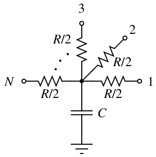
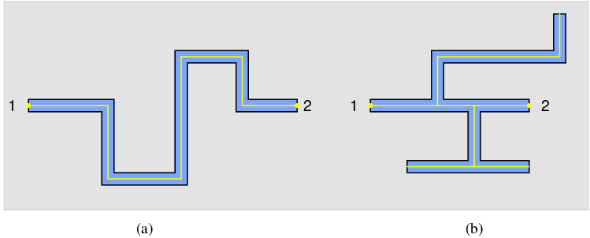
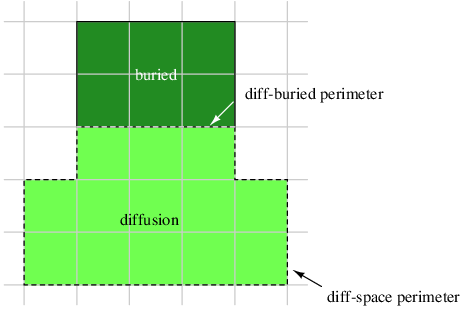

* TOC
{:toc }

Magic Tutorial \#8: Circuit
Extraction  
Walter Scott  
Special Studies Program  
Lawrence Livermore National Laboratory  
P.O. Box 808, L-270  
Livermore, CA 94550  
(Updated by others, too.)  
This tutorial corresponds to Magic version 7.  

Tutorials to read first:

<table class="tabbing" data-cellpadding="0" data-border="0">
<colgroup>
<col style="width: 100%" />
</colgroup>
<tbody>
<tr class="odd tabbing" style="vertical-align:baseline;">
<td class="tabbing">Magic Tutorial #1: Getting Started 
Magic Tutorial #2: Basic Painting and Selection 
Magic Tutorial #4: Cell Hierarchies</td>
</tr>
</tbody>
</table>

Commands introduced in this
tutorial:

<table class="tabbing" data-cellpadding="0" data-border="0">
<tbody>
<tr class="odd tabbing" style="vertical-align:baseline;">
<td class="tabbing">:extract</td>
</tr>
</tbody>
</table>

Macros introduced in this tutorial:

<table class="tabbing" data-cellpadding="0" data-border="0">
<tbody>
<tr class="odd tabbing" style="vertical-align:baseline;">
<td class="tabbing">(none)</td>
</tr>
</tbody>
</table>

Changes since Magic version 4:

<table class="tabbing" data-cellpadding="0" data-border="0">
<colgroup>
<col style="width: 100%" />
</colgroup>
<tbody>
<tr class="odd tabbing" style="vertical-align:baseline;">
<td class="tabbing">New form of :extract
unique 
Path length extraction with :extract
length 
Accurate resistance extraction with :extresis 
Extraction of well connectivity and substrate nodes 
Checking for global net connectedness in ext2sim (1) 
New programs: ext2spice (1) and
extcheck (1) 
</td>
</tr>
</tbody>
</table>

### 1  Introduction

This tutorial covers the use of Magic’s circuit extractor. The extractor
computes from the layout the information needed to run simulation tools
such as crystal (1) and esim (1). This information includes the
sizes and shapes of transistors, and the connectivity, resistance, and
parasitic capacitance of nodes. Both capacitance to substrate and
several kinds of internodal coupling capacitances are extracted.

Magic’s extractor is both incremental and hierarchical: only part of the
entire layout must be re-extracted after each change, and the structure
of the extracted circuit parallels the structure of the layout being
extracted. The extractor produces a separate .ext file for each .mag file in a hierarchical design. This
is in contrast to previous extractors, such as Mextra, which produces a
single .sim file that represents the
flattened (fully-instantiated) layout.

Sections 2 through 4 introduce Magic’s :extract command and some of its more
advanced features. Section 5 describes what information actually gets
extracted, and discusses limitations and inaccuracies. Section 6 talks
about extraction styles. Although the hierarchical ext (5) format fully describes the
circuit implemented by a layout, very few tools currently accept it. It
is normally necessary to flatten the extracted circuit using one of the
programs discussed in Section 7, such as ext2sim (1), ext2spice (1), or extcheck (1).

### 2  Basic Extraction

You can use Magic’s extractor in one of several ways. Normally it is not
necessary to extract all cells in a layout. To extract only those cells
that have changed since they were extracted, use:

<table class="tabbing" data-cellpadding="0" data-border="0">
<colgroup>
<col style="width: 100%" />
</colgroup>
<tbody>
<tr class="odd tabbing" style="vertical-align:baseline;">
<td class="tabbing">:load root 
:extract</td>
</tr>
</tbody>
</table>

The extractor looks for a .ext file
for every cell in the tree that descends from the cell root. The .ext file is searched for in the same
directory that contains the cell’s .mag
file. Any cells that have been modified since they were last
extracted, and all of their parents, are re-extracted. Cells having no
.ext files are also re-extracted.

To try out the extractor on an example, copy all the tut8x
cells to your current directory with the following shell
commands:

<table class="tabbing" data-cellpadding="0" data-border="0">
<tbody>
<tr class="odd tabbing" style="vertical-align:baseline;">
<td class="tabbing">cp
~cad/lib/magic/tutorial/tut8*.mag  .</td>
</tr>
</tbody>
</table>

Start magic on the cell tut8a and
type :extract. Magic will print the
name of each cell (tut8a, tut8b, tut8c, and tut8d) as it is extracted. Now type :extract a second time. This time nothing
gets printed, since Magic didn’t have to re-extract any cells. Now
delete the piece of poly labelled “delete
me” and type :extract again.
This time, only the cell tut8a is
extracted as it is the only one that changed. If you make a change to
cell tut8b (do it) and then extract
again, both tut8b and tut8a will be re-extracted, since tut8a is the parent of tut8b.

To force all cells in the subtree rooted at cell root to be re-extracted, use :extract all:

<table class="tabbing" data-cellpadding="0" data-border="0">
<colgroup>
<col style="width: 100%" />
</colgroup>
<tbody>
<tr class="odd tabbing" style="vertical-align:baseline;">
<td class="tabbing">:loadroot 
:extract all</td>
</tr>
</tbody>
</table>

Try this also on tut8a.

You can also use the :extract
command to extract a single cell as follows:

<table class="tabbing" data-cellpadding="0" data-border="0">
<tbody>
<tr class="odd tabbing" style="vertical-align:baseline;">
<td class="tabbing">:extract cell
name</td>
</tr>
</tbody>
</table>

will extract just the selected (current) cell, and place the output in
the file name. Select the cell
tut8b (tut8b\_0) and type :extract cell differentFile to try this
out. After this command, the file differentFile.ext will contain the
extracted circuit for the cell tut8b. The children of tut8b (in this case, the single cell tut8d) will not be re-extracted by this
command. If more than one cell is selected, the upper-leftmost one is
extracted.

You should be careful about using :extract
cell, since even though you may only make a change to a child
cell, all of its parents may have to be re-extracted. To re-extract all
of the parents of the selected cell, you may use

<table class="tabbing" data-cellpadding="0" data-border="0">
<tbody>
<tr class="odd tabbing" style="vertical-align:baseline;">
<td class="tabbing">:extract
parents</td>
</tr>
</tbody>
</table>

Try this out with tut8b still
selected. Magic will extract only the cell tut8a, since it is the only one that uses
the cell tut8b. To see what cells
would be extracted by :extract parents
without actually extracting them, use

<table class="tabbing" data-cellpadding="0" data-border="0">
<tbody>
<tr class="odd tabbing" style="vertical-align:baseline;">
<td class="tabbing">:extract
showparents</td>
</tr>
</tbody>
</table>

Try this command as well.

### 3  Feedback: Errors and Warnings

When the extractor encounters problems, it leaves feedback in the form
of stippled white rectangular areas on the screen. Each area covers the
portion of the layout that caused the error. Each area also has an error
message associated with it, which you can see by using the :feedback command. Type :feedback help while in Magic for
assistance in using the :feedback
command.

The extractor will always report extraction errors. These are problems in the layout
that may cause the output of the extractor to be incorrect. The layout
should be fixed to eliminate extraction errors before attempting to
simulate the circuit; otherwise, the results of the simulation may not
reflect reality.

Extraction errors can come from violations of transistor rules. There
are two rules about the formation of transistors: no transistor can be
formed, and none can be destroyed, as a result of cell overlaps. For
example, it is illegal to have poly in one cell overlap diffusion in
another cell, as that would form a transistor in the parent where none
was present in either child. It is also illegal to have a buried contact
in one cell overlap a transistor in another, as this would destroy the
transistor. Violating these transistor rules will cause design-rule
violations as well as extraction errors. These errors only relate to
circuit extraction: the fabricated circuit may still work; it just won’t
be extracted correctly.

In general, it is an error for material of two types on the same plane
to overlap or abut if they don’t connect to each other. For example, in
CMOS it is illegal for p-diffusion and n-diffusion to overlap or abut.

In addition to errors, the extractor can give warnings. If only warnings are present,
the extracted circuit can still be simulated. By default, only some
types of warnings are reported and displayed as feedback. To cause all
warnings to be displayed, use

<table class="tabbing" data-cellpadding="0" data-border="0">
<tbody>
<tr class="odd tabbing" style="vertical-align:baseline;">
<td class="tabbing">:extract warn
all</td>
</tr>
</tbody>
</table>

The command

<table class="tabbing" data-cellpadding="0" data-border="0">
<tbody>
<tr class="odd tabbing" style="vertical-align:baseline;">
<td class="tabbing">:extract warn
warning</td>
</tr>
</tbody>
</table>

may be used to enable specific warnings selectively; see below. To cause
no warnings to be displayed, or to disable display of a particular warning, use respectively

<table class="tabbing" data-cellpadding="0" data-border="0">
<colgroup>
<col style="width: 100%" />
</colgroup>
<tbody>
<tr class="odd tabbing" style="vertical-align:baseline;">
<td class="tabbing">:extract warn no all
or 
:extract warn no warning</td>
</tr>
</tbody>
</table>

Three different kinds of warnings are generated. The dup warning checks to see whether you have
two electrically unconnected nodes in the same cell labelled with the
same name. If so, you are warned because the two unconnected nodes will
appear to be connected in the resulting .ext file, which means that the extracted
circuit would not represent the actual layout. This is bad if you’re
simulating the circuit to see if it will work correctly: the simulator
will think the two nodes are connected, but since there’s no physical
wire between them, the electrons won’t! When two unconnected nodes share
the same label (name), the extractor leaves feedback squares over each
instance of the shared name.

It’s an excellent idea to avoid labelling two unconnected nodes with the
same name within a cell. Instead, use the ”correct” name for one of the
nodes, and some mnemonic but textually distinct name for the other
nodes. For example, in a cell with multiple power rails, you might use
Vdd! for one of the rails, and names
like Vdd#1 for the others. As an
example, load the cell tut8e. If the
two nodes are connected in a higher-level cell they will eventually be
merged when the extracted circuit is flattened. If you want to simulate
a cell out of context, but still want the higher-level nodes to be
hooked up, you can always create a dummy parent cell that hooks them
together, either with wire or by using the same name for pieces of paint
that lie over the terminals to be connected; see the cell tut8f for an example of this latter
technique.

You can use the command

<table class="tabbing" data-cellpadding="0" data-border="0">
<tbody>
<tr class="odd tabbing" style="vertical-align:baseline;">
<td class="tabbing">:extract
unique</td>
</tr>
</tbody>
</table>

as an automatic means of labelling nodes in the manner described above.
Run this command on the cell tut8g.
A second version of this command is provided for compatibility with
previous versions of Magic. Running

<table class="tabbing" data-cellpadding="0" data-border="0">
<tbody>
<tr class="odd tabbing" style="vertical-align:baseline;">
<td class="tabbing">:extract unique
#</td>
</tr>
</tbody>
</table>

will only append a unique numeric suffix to labels that end with a
“\#”. Any other duplicate nodenames
that also don’t end in a “!” (the
global nodename suffix as described in Section 5) are flagged by
feedback.

A second type of warning, fets,
checks to see whether any transistors have fewer diffusion terminals
than the minimum for their types. For example, the transistor type
“dfet” is defined in the nmos technology file as requiring two
diffusion terminals: a source and a drain. If a capacitor with only one
diffusion terminal is desired in this technology, the type dcap should be used instead. The fets warning is a consistency check for
transistors whose diffusion terminals have been accidentally shorted
together, or for transistors with insufficiently many diffusion
terminals.

The third warning, labels, is
generated if you violate the following guideline for placement of
labels: Whenever geometry from two subcells abuts or overlaps, it’s a
good idea to make sure that there is a label attached to the geometry in
each subcell in the area of the overlap or
along the line of abutment. Following this guideline isn’t
necessary for the extractor to work, but it will result in noticeably
faster extraction.

By default, the dup and fets warnings are enabled, and the labels warning is disabled.

Load the cell tut8h, expand all its
children (tut8i and tut8j), and enable all extractor warnings
with :extract warn all. Now extract
tut8h and all of its children with
:extract, and examine the feedback
for examples of fatal errors and warnings.

### 4  Advanced Circuit Extraction

#### 4.1  Lengths

The Magic extractor has a rudimentary ability to compute wire lengths
between specific named points in a circuit. This feature is intended for
use with technologies where the wire length between two points is more
important than the total capacitance on the net; this may occur, for
example, when extracting circuits with very long wires being driven at
high speeds (e.g., bipolar
circuits). Currently, you must indicate to Magic which pairs of points
are to have distances computed. You do this by providing two lists: one
of drivers and one of receivers. The extractor computes the
distance between each driver and each receiver that it is connected to.

Load the cell tut8k. There are five
labels: two are drivers (driver1 and
driver2) and three are receivers
(receiverA, receiverB, and receiverC). Type the commands:

<table class="tabbing" data-cellpadding="0" data-border="0">
<colgroup>
<col style="width: 100%" />
</colgroup>
<tbody>
<tr class="odd tabbing" style="vertical-align:baseline;">
<td class="tabbing">:extract length driver
driver1 driver2 
:extract length receiver receiverA
receiverB receiverC</td>
</tr>
</tbody>
</table>

Now enable extraction of lengths with :extract do length and then extract the
cell (:extract). If you examine
tut8k.ext, you will see several
distance lines, corresponding to the
driver-receiver distances described above. These distances are through
the centerlines of wires connecting the two labels; where multiple paths
exist, the shortest is used.

Normally the driver and receiver tables will be built by using :source to read a file of :extract length driver and :extract length receiver commands. Once
these tables are created in Magic, they remain until you leave Magic or
type the command

<table class="tabbing" data-cellpadding="0" data-border="0">
<tbody>
<tr class="odd tabbing" style="vertical-align:baseline;">
<td class="tabbing">:extract length
clear</td>
</tr>
</tbody>
</table>

which wipes out both tables.

Because extraction of wire lengths is not
performed hierarchically, it should only be done in the root cell
of a design. Also, because it’s not hierarchical, it can take a long
time for long, complex wires such as power and ground nets. This feature
is still experimental and subject to change.

#### 4.2  Resistance

Magic provides for more accurate resistance extraction using the :extresis command. :extresis provides a detailed
resistance/capacitance description for nets where parasitic resistance
is likely to significantly affect circuit timing.

##### 4.2.1  Tutorial Introduction

To try out the resistance extractor, load in the cell tut8r. Extract it using :extract, pause magic, and run ext2sim on
the cell with the command

<table class="tabbing" data-cellpadding="0" data-border="0">
<tbody>
<tr class="odd tabbing" style="vertical-align:baseline;">
<td class="tabbing">ext2sim
tut8r</td>
</tr>
</tbody>
</table>

This should produce tut8r.sim, tut8r.nodes, and tut8r.al. Restart magic and type

<table class="tabbing" data-cellpadding="0" data-border="0">
<colgroup>
<col style="width: 100%" />
</colgroup>
<tbody>
<tr class="odd tabbing" style="vertical-align:baseline;">
<td class="tabbing">:extresis tolerance
10 
:extresis</td>
</tr>
</tbody>
</table>

This will extract interconnect resistances for any net where the
interconnect delay is at least one-tenth of the transistor delay. Magic
should give the messages:

<table class="tabbing" data-cellpadding="0" data-border="0">
<colgroup>
<col style="width: 100%" />
</colgroup>
<tbody>
<tr class="odd tabbing" style="vertical-align:baseline;">
<td class="tabbing">:extresis tolerance
10 
:extresis 
Adding net2; Tnew = 0.428038ns,Told =
0.3798ns 
Adding net1; Tnew = 0.529005ns,Told =
0.4122ns 
Total Nets: 7 
Nets extracted: 2 (0.285714) 
Nets output: 2 (0.285714)</td>
</tr>
</tbody>
</table>

These may vary slightly depending on your technology parameters. The
Adding \[net\] lines describe which
networks for which magic produced resistor networks. Tnew is the estimated delay on the net
including the resistor parasitics, while Told is the delay without parasitics. The
next line describes where magic thinks the slowest node in the net is.
The final 3 lines give a brief summary of the total number of nets, the
nets requiring extraction, and the number for which resistors were added
to the output.

Running the resistance extractor also produced the file cell.res.ext. To produce a .sim file containing resistors, quit magic
and type:

<table class="tabbing" data-cellpadding="0" data-border="0">
<colgroup>
<col style="width: 100%" />
</colgroup>
<tbody>
<tr class="odd tabbing" style="vertical-align:baseline;">
<td class="tabbing">cat tut8r.ext
tut8r.res.ext &gt;tut8r.2.ext 
ext2sim -R -t! -t# tut8r.2</td>
</tr>
</tbody>
</table>

Comparing the two files, tut8r.sim
and tut8r.2.sim, shows that
the latter has the nodes net1 and net2 split into several parts, with
resistors added to connect the new nodes together.

##### 4.2.2  General Notes on using the resistance extractor

To use :extresis, the circuit must
first be extracted using :extract
and flattened using ext2sim. When ext2sim is run, do not use the
-t# and -t! flags (i.e. don’t trim the trailing
”#” and ”!” characters) or the -R
flag because :extresis needs the
.sim and .ext names to correspond exactly, and it
needs the lumped resistance values that the extractor produces. Also, do
not delete or rename the .nodes
file; :extresis needs this to
run. Once the .sim and .nodes files have been produced, type the
command :extresis while running
magic on the root cell. As the resistance extractor runs, it will
identify which nets (if any) for which it is producing RC networks, and
will identify what it thinks is the ”slowest” point in the network. When
it completes, it will print a brief summary of how many nets it
extracted and how many required supplemental networks. The resistance
networks are placed in the file root.res.ext. To produce a .sim file with the supplemental resistors,
type cat root.ext root.res.ext
&gt;newname.ext, and then rerun
ext2sim on the new file. During this
second ext2sim run, the -t flag may be used.

Like extraction of wire lengths, resistance extraction is not performed hierarchically; it should
only be done in the root cell of a design and can take a long time for
complex wires.

##### 4.2.3  Options, Features, Caveats and Bugs

The following is a list of command line options and the arguments that
they take.

-   tolerance \[value\]   
    This controls how large the resistance in a network must be before
    it is added to the output description. value is defined as the minimum ratio
    of transistor resistance to interconnect resistance that requires a
    resistance network. The default value is 1; values less than 1 will
    cause fewer resistors to be output and will make the program run
    faster, while values greater than 1 will produce more a larger, more
    accurate description but will run slower.

-   all   
    Causes all nets in the circuit to be extracted; no comparison
    between transistor size and lumped resistance is performed. This
    option is not recommended for large designs.

-   simplify \[on/off\]   
    Turns on/off the resistance network simplification routines. Magic
    normally simplifies the resistance network it extracts by removing
    small resistors; specifying this flag turns this feature off.

-   extout \[on/off\]   
    Turns on and off the writing of the root.res.ext file. The default value
    is on.

-   lumped \[on/off\]   
    Turns on the writing of root.res.lump. This file contains an
    updated value of the lumped resistance for each net that :extresis extracts.

-   silent \[on/off\]   
    This option suppresses printing of the name and location of nets for
    which resistors are produced.

-   skip mask   
    Specifies a list of layers that the resistance extractor is to
    ignore.

-   help   
    Print brief list of options.

Attribute labels may also be used to specify certain extractor options.
For a description of attributes and how they work, see tutorial 2.
Following is a description of :extresis
attributes.

-   res:skip@   
    Causes this net to be skipped. This is useful for avoiding
    extraction of power supplies or other DC signals that are not
    labeled Vdd or GND.

-   res:force@   
    Forces extraction of this net regardless of its lumped resistance
    value. Nets with both skip and force labels attached will cause the
    extractor to complain.

-   res:min=\[value\]@   
    Sets the smallest resistor size for this net. The default value is
    the resistance of the largest driving transistor divided by the
    tolerance described above.

-   res:drive@ - Nets with no
    driving transistors will normally not be extracted. This option
    allows the designer to specify from where in the net the signal is
    driven. This is primarily useful when extracting subcells, where the
    transistors driving a given signal may be located in a different
    cell.

##### 4.2.4  Technology File Changes

Certain changes must be made in the extract section of the technology
file to support resistance extraction. These include the fetresist and contact lines, plus a small change to the
fet line. Full details can be found in Magic Maintainer’s Manual \#2.
The only thing to note is that, contrary to the documentation, the gccap and gscap parts of the fet line MUST be set;
the resistance extractor uses them to calculate RC time constants for
the circuit.

### 5  Extraction Details and Limitations

This section explores in greater depth what gets extracted by Magic, as
well as the limitations of the circuit extractor. A detailed explanation
of the format of the .ext files
output by Magic may be found in the manual page ext (5). “Magic Maintainer’s Manual #2:
The Technology File” describes how extraction parameters are specified
for the extractor.

<figure>

<figcaption aria-hidden="true">Figure 1: Each node extracted by Magic has a lumped resistance
R and a lumped capacitance C to the substrate. These lumped values
can be interpreted as in the diagram above, in which each device
connected to the node is attached to one of the points 1, 2, …, N.</figcaption>
</figure>

#### 5.1  Nodes

Magic approximates the pieces of interconnect between transistors as
“nodes”. A node is like an equipotential region, but also includes a
lumped resistance and capacitance to substrate. Figure 1 shows how these
lumped values are intended to be interpreted by the analysis programs
that use the extracted circuit.

Each node in an extracted circuit has a name, which is either one of the
labels attached to the geometry in the node if any exist, or
automatically generated by the extractor. These latter names are always
of the form p\_x\_y#, where p, x, and y
are integers, e.g., 3\_104\_17#. If a label ending in the character
“!” is attached to a node, the node
is considered to be a “global”. Post-processing programs such as ext2sim (1) will check to ensure that
nodes in different cells that are labelled with the same global name are
electrically connected.

Nodes may have attributes attached to them as well as names. Node
attributes are labels ending in the special character “@”, and provide a mechanism for passing
information to analysis programs such as crystal (1). The man page ext (5) provides additional information
about node attributes.

#### 5.2  Resistance

Magic extracts a lumped resistance for each node, rather than a
point-to-point resistance between each pair of devices connected to that
node. The result is that all such point-to-point resistances are
approximated by the worst-case resistance between any two points in that
node.

By default, node resistances are approximated rather than computed
exactly. For a node comprised entirely of a single type of material,
Magic will compute the node’s total perimeter and area. It then solves a
quadratic equation to find the width and height of a simple rectangle
with this same perimeter and area, and approximates the resistance of
the node as the resistance of this “equivalent” rectangle. The
resistance is always taken in the longer dimension of the rectangle.
When a node contains more than a single type of material, Magic computes
an equivalent rectangle for each type, and then sums the resistances as
though the rectangles were laid end-to-end.

This approximation for resistance does not take into account any
branching, so it can be significantly in error for nodes that have side
branches. Figure 2 gives an example. For global signal trees such as
clocks or power, Magic’s estimate of resistance will likely be several
times higher than the actual resistance between two points.

<figure>

<figcaption aria-hidden="true">Figure 2: Magic approximates the resistance of a node by assuming
that it is a simple wire. The length and width of the wire are estimated
from the node’s perimeter and area. (a) For non-branching nodes, this
approximation is a good one. (b) The computed resistance for this node
is the same as for (a) because the side branches are counted, yet the
actual resistance between points 1 and 2 is significantly less than in
(a).</figcaption>
</figure>

The approximated resistance also does not lend itself well to
hierarchical adjustments, as does capacitance. To allow programs like
ext2sim to incorporate hierarchical
adjustments into a resistance approximation, each node in the .ext file also contains a perimeter and
area for each “resistance class” that was defined in the technology file
(see “Maintainer’s Manual \#2: The Technology File,” and ext (5)). When flattening a circuit,
ext2sim uses this information along
with adjustments to perimeter and area to produce the value it actually
uses for node resistance.

If you wish to disable the extraction of resistances and node perimeters
and areas, use the command

<table class="tabbing" data-cellpadding="0" data-border="0">
<tbody>
<tr class="odd tabbing" style="vertical-align:baseline;">
<td class="tabbing">:extract no
resistance</td>
</tr>
</tbody>
</table>

which will cause all node resistances, perimeters, and areas in the
.ext file to be zero. To re-enable
extraction of resistance, use the command

<table class="tabbing" data-cellpadding="0" data-border="0">
<tbody>
<tr class="odd tabbing" style="vertical-align:baseline;">
<td class="tabbing">:extract do
resistance.</td>
</tr>
</tbody>
</table>

Sometimes it’s important that resistances be computed more accurately
than is possible using the lumped approximation above. Magic’s :extresist command does this by computing
explicit two-terminal resistors and modifying the circuit network to
include them so it reflects more exactly the topology of the layout. See
the section on Advanced Extraction
for more details on explicit resistance extraction with :extresist.

<figure>

<figcaption aria-hidden="true">Figure 3: Each type of edge has capacitance to substrate per unit
length. Here, the diffusion-space perimeter of 13 units has one value
per unit length, and the diffusion-buried perimeter of 3 units another.
In addition, each type of material has capacitance per unit
area.</figcaption>
</figure>

#### 5.3  Capacitance

Capacitance to substrate comes from two different sources. Each type of
material has a capacitance to substrate per unit area. Each type of edge
(i.e, each pair of types) has a capacitance to substrate per unit
length. See Figure 3. The computation of capacitance may be disabled
with

<table class="tabbing" data-cellpadding="0" data-border="0">
<tbody>
<tr class="odd tabbing" style="vertical-align:baseline;">
<td class="tabbing">:extract no
capacitance</td>
</tr>
</tbody>
</table>

which causes all substrate capacitance values in the .ext file to be zero. It may be re-enabled
with

<table class="tabbing" data-cellpadding="0" data-border="0">
<tbody>
<tr class="odd tabbing" style="vertical-align:baseline;">
<td class="tabbing">:extract do
capacitance.</td>
</tr>
</tbody>
</table>

Internodal capacitance comes from three sources, as shown in Figure 4.
When materials of two different types overlap, the capacitance to
substrate of the one on top (as determined by the technology) is
replaced by an internodal capacitance to the one on the bottom. Its
computation may be disabled with

<table class="tabbing" data-cellpadding="0" data-border="0">
<tbody>
<tr class="odd tabbing" style="vertical-align:baseline;">
<td class="tabbing">:extract no
coupling</td>
</tr>
</tbody>
</table>

which will also cause the extractor to run 30% to 50% faster. Extraction
of coupling capacitances can be re-enabled with

<table class="tabbing" data-cellpadding="0" data-border="0">
<tbody>
<tr class="odd tabbing" style="vertical-align:baseline;">
<td class="tabbing">:extract do
coupling.</td>
</tr>
</tbody>
</table>

<figure>

<figcaption aria-hidden="true">Figure 4: Magic extracts three kinds of internodal coupling
capacitance. This figure is a cross-section (side view, not a top view)
of a set of masks that shows all three kinds of capacitance. Overlap capacitance is parallel-plate
capacitance between two different kinds of material when they overlap.
Sidewall capacitance is
parallel-plate capacitance between the vertical edges of two pieces of
the same kind of material. Sidewall
overlap capacitance is orthogonal-plate capacitance between the
vertical edge of one piece of material and the horizontal surface of
another piece of material that overlaps the first
edge.</figcaption>
</figure>

<figure>

<figcaption aria-hidden="true">Figure 5: (a) When transistors are rectangular, it is possible to
compute <em>L</em>/<em>W</em> exactly.
Here gateperim = 4, srcperim = 6, drainperim = 6, and <em>L</em>/<em>W</em>=2/6. (b) The <em>L</em>/<em>W</em> of non-branching
transistors can be approximated. Here gateperim = 4, srcperim = 6, drainperim = 10. By averaging srcperim and drainperim we get <em>L</em>/<em>W</em>=2/8. (c) The <em>L</em>/<em>W</em> of branching
transistors is not well approximated. Here gateperim = 16, srcperim = 2, drainperim = 2. Magic’s estimate of <em>L</em>/<em>W</em> is 8/2, whereas in fact because of current
spreading, <em>W</em> is effectively
larger than 2 and <em>L</em> effectively smaller than 8, so <em>L</em>/<em>W</em> is
overestimated.</figcaption>
</figure>

Whenever material from two subcells overlaps or abuts, the extractor
computes adjustments to substrate capacitance, coupling capacitance, and
node perimeter and area. Often, these adjustments make little difference
to the type of analysis you are performing, as when you wish only to
compare netlists. Even when running Crystal for timing analysis, the
adjustments can make less than a 5% difference in the timing of critical
paths in designs with only a small amount of inter-cell overlap. To
disable the computation of these adjustments, use

<table class="tabbing" data-cellpadding="0" data-border="0">
<tbody>
<tr class="odd tabbing" style="vertical-align:baseline;">
<td class="tabbing">:extract no
adjustment</td>
</tr>
</tbody>
</table>

which will result in approximately 50% faster extraction. This speedup
is not entirely additive with the speedup resulting from :extract no coupling. To re-enable
computation of adjustments, use :extract
do adjustment.

#### 5.4  Transistors

Like the resistances of nodes, the lengths and widths of transistors are
approximated. Magic computes the contribution to the total perimeter by
each of the terminals of the transistor. See Figure 5. For rectangular
transistors, this yields an exact $L
/ W$. For non-branching,
non-rectangular transistors, it is still possible to approximate $L / W$
fairly well, but substantial inaccuracies can be introduced if
the channel of a transistor contains branches. Since most transistors
are rectangular, however, Magic’s approximation works well in practice.

<table id="TBL-1" class="tabular" data-rules="groups">
<tbody>
<tr class="odd hline">
<td>
</td>
<td>
</td>
<td>
</td>
<td>
</td>
<td>
</td>
<td>
</td>
<td>
</td>
</tr>
<tr id="TBL-1-1-" class="even" style="vertical-align:baseline;">
<td id="TBL-1-1-1" class="td11"
style="text-align: center; white-space: nowrap;">Type</td>
<td id="TBL-1-1-2" class="td11"
style="text-align: center; white-space: nowrap;">Loc</td>
<td id="TBL-1-1-3" class="td11"
style="text-align: center; white-space: nowrap;">A P</td>
<td id="TBL-1-1-4" class="td11"
style="text-align: center; white-space: nowrap;">Subs</td>
<td id="TBL-1-1-5" class="td11"
style="text-align: center; white-space: nowrap;">Gate</td>
<td id="TBL-1-1-6" class="td11"
style="text-align: center; white-space: nowrap;">Source</td>
<td id="TBL-1-1-7" class="td11"
style="text-align: center; white-space: nowrap;">Drain</td>
</tr>
<tr class="odd hline">
<td>
</td>
<td>
</td>
<td>
</td>
<td>
</td>
<td>
</td>
<td>
</td>
<td>
</td>
</tr>
<tr id="TBL-1-2-" class="even" style="vertical-align:baseline;">
<td id="TBL-1-2-1" class="td11"
style="text-align: center; white-space: nowrap;">fet nfet</td>
<td id="TBL-1-2-2" class="td11"
style="text-align: center; white-space: nowrap;">59 1 60 2</td>
<td id="TBL-1-2-3" class="td11"
style="text-align: center; white-space: nowrap;">8 12</td>
<td id="TBL-1-2-4" class="td11"
style="text-align: center; white-space: nowrap;">GND!</td>
<td id="TBL-1-2-5" class="td11"
style="text-align: center; white-space: nowrap;">Mid2 4 N3</td>
<td id="TBL-1-2-6" class="td11"
style="text-align: center; white-space: nowrap;">Out 4 0</td>
<td id="TBL-1-2-7" class="td11"
style="text-align: center; white-space: nowrap;">Vss#0 4 0</td>
</tr>
<tr id="TBL-1-3-" class="odd" style="vertical-align:baseline;">
<td id="TBL-1-3-1" class="td11"
style="text-align: center; white-space: nowrap;">fet nfet</td>
<td id="TBL-1-3-2" class="td11"
style="text-align: center; white-space: nowrap;">36 1 37 2</td>
<td id="TBL-1-3-3" class="td11"
style="text-align: center; white-space: nowrap;">8 12</td>
<td id="TBL-1-3-4" class="td11"
style="text-align: center; white-space: nowrap;">Float</td>
<td id="TBL-1-3-5" class="td11"
style="text-align: center; white-space: nowrap;">Mid1 4 N2</td>
<td id="TBL-1-3-6" class="td11"
style="text-align: center; white-space: nowrap;">Mid2 4 0</td>
<td id="TBL-1-3-7" class="td11"
style="text-align: center; white-space: nowrap;">Vss#0 4 0</td>
</tr>
<tr id="TBL-1-4-" class="even" style="vertical-align:baseline;">
<td id="TBL-1-4-1" class="td11"
style="text-align: center; white-space: nowrap;">fet nfet</td>
<td id="TBL-1-4-2" class="td11"
style="text-align: center; white-space: nowrap;">4 1 5 2</td>
<td id="TBL-1-4-3" class="td11"
style="text-align: center; white-space: nowrap;">8 12</td>
<td id="TBL-1-4-4" class="td11"
style="text-align: center; white-space: nowrap;">Vss#0</td>
<td id="TBL-1-4-5" class="td11"
style="text-align: center; white-space: nowrap;">In 4 N1 </td>
<td id="TBL-1-4-6" class="td11"
style="text-align: center; white-space: nowrap;">Mid1 4 0</td>
<td id="TBL-1-4-7" class="td11"
style="text-align: center; white-space: nowrap;">Vss#0 4 0</td>
</tr>
<tr id="TBL-1-5-" class="odd" style="vertical-align:baseline;">
<td id="TBL-1-5-1" class="td11"
style="text-align: center; white-space: nowrap;">fet pfet</td>
<td id="TBL-1-5-2" class="td11"
style="text-align: center; white-space: nowrap;">59 25 60 26</td>
<td id="TBL-1-5-3" class="td11"
style="text-align: center; white-space: nowrap;">8 12</td>
<td id="TBL-1-5-4" class="td11"
style="text-align: center; white-space: nowrap;">Vdd!</td>
<td id="TBL-1-5-5" class="td11"
style="text-align: center; white-space: nowrap;">Mid2 4 P3</td>
<td id="TBL-1-5-6" class="td11"
style="text-align: center; white-space: nowrap;">Vdd#0 4 0</td>
<td id="TBL-1-5-7" class="td11"
style="text-align: center; white-space: nowrap;">Out 4 0</td>
</tr>
<tr id="TBL-1-6-" class="even" style="vertical-align:baseline;">
<td id="TBL-1-6-1" class="td11"
style="text-align: center; white-space: nowrap;">fet pfet</td>
<td id="TBL-1-6-2" class="td11"
style="text-align: center; white-space: nowrap;">36 25 37 26</td>
<td id="TBL-1-6-3" class="td11"
style="text-align: center; white-space: nowrap;">8 12</td>
<td id="TBL-1-6-4" class="td11"
style="text-align: center; white-space: nowrap;">VBias</td>
<td id="TBL-1-6-5" class="td11"
style="text-align: center; white-space: nowrap;">Mid1 4 P2</td>
<td id="TBL-1-6-6" class="td11"
style="text-align: center; white-space: nowrap;">Vdd#0 4 0</td>
<td id="TBL-1-6-7" class="td11"
style="text-align: center; white-space: nowrap;">Mid2 4 0</td>
</tr>
<tr id="TBL-1-7-" class="odd" style="vertical-align:baseline;">
<td id="TBL-1-7-1" class="td11"
style="text-align: center; white-space: nowrap;">fet pfet</td>
<td id="TBL-1-7-2" class="td11"
style="text-align: center; white-space: nowrap;">4 25 5 26</td>
<td id="TBL-1-7-3" class="td11"
style="text-align: center; white-space: nowrap;">8 12</td>
<td id="TBL-1-7-4" class="td11"
style="text-align: center; white-space: nowrap;">Vdd#0</td>
<td id="TBL-1-7-5" class="td11"
style="text-align: center; white-space: nowrap;">In 4 P1 </td>
<td id="TBL-1-7-6" class="td11"
style="text-align: center; white-space: nowrap;">Vdd#0 4 0</td>
<td id="TBL-1-7-7" class="td11"
style="text-align: center; white-space: nowrap;">Mid1 4 0</td>
</tr>
<tr class="even hline">
<td>
</td>
<td>
</td>
<td>
</td>
<td>
</td>
<td>
</td>
<td>
</td>
<td>
</td>
</tr>
<tr id="TBL-1-8-" class="odd" style="vertical-align:baseline;">
<td id="TBL-1-8-1" class="td11"
style="text-align: center; white-space: nowrap;"></td>
<td></td>
<td></td>
<td></td>
<td></td>
<td></td>
<td></td>
</tr>
</tbody>
</table>

Table 1: The transistor
section of tut8l.ext.

In addition to having gate, source, and drain terminals, MOSFET
transistors also have a substrate terminal. By default, this terminal is
connected to a global node that depends on the transistor’s type. For
example, p-channel transistors might have a substrate terminal of Vdd!, while n-channel transistors would
have one of GND!. However, when a
transistor is surrounded by explicit “well” material (as defined in the
technology file), Magic will override the default substrate terminal
with the node to which the well material is connected. This has several
advantages: it allows simulation of analog circuits in which wells are
biased to different potentials, and it provides a form of checking to
ensure that wells in a CMOS process are explicitly tied to the
appropriate DC voltage.

Transistor substrate nodes are discovered by the extractor only if the
transistor and the overlapping well layer are in the same cell. If they
appear in different cells, the transistor’s substrate terminal will be
set to the default for the type of transistor.

Load the cell tut8l, extract it, and
look at the file tut8l.ext. Table 1
shows the lines for the six transistors in the file. You’ll notice that
the substrate terminals (the Subs
column) for all transistors are different. Since each transistor
in this design has a different gate attribute attached to it (shown in
bold in the table, e.g., N1, P2, etc), we’ll use them in the following
discussion.

The simplest two transistors are N3
and P3, which don’t appear in
any explicitly drawn wells. The substrate terminals for these are GND! and Vdd!
respectively, since that’s what the technology file says is the
default for the two types of transistors. N1 and P1
are standard transistors that lie in wells tied to the ground and
power rails, labelled in this cell as Vss#0 and Vdd#0 respectively. (They’re not labelled
GND! and Vdd! so you’ll see the difference between
N1 and N3). P2
lies in a well that is tied to a different bias voltage, VBias, such as might occur in an analog
design. Finally, N2 is in a well
that isn’t tied to any wire. The substrate node appears as Float because that’s the label that was
attached to the well surrounding N2.

The ability to extract transistor substrate nodes allows you to perform
a simple check for whether or not transistors are in properly connected
(e.g., grounded) wells. In a p-well
CMOS process, for example, you might set the default substrate node for
n-channel transistors to be some distinguished global node other than
ground, e.g., NSubstrateNode!. You could then extract
the circuit, flatten it using ext2spice (1) (which preserves substrate
nodes, unlike ext2sim (1) which
ignores them), and look at the substrate node fields of all the
n-channel transistors: if there were any whose substrate nodes weren’t
connected to GND!, then these
transistors appear either outside of any explicit well (their substrate
nodes will be the default of NSubstrateNode), or in a well that isn’t
tied to GND! with a substrate
contact.

### 6  Extraction styles

Magic usually knows several different ways to extract a circuit from a
given layout. Each of these ways is called a style. Different styles can be used to
handle different fabrication facilities, which may differ in the
parameters they have for parasitic capacitance and resistance. For a
scalable technology, such as the default scmos, there can be a different extraction
style for each scale factor. The exact number and nature of the
extraction styles is described in the technology file that Magic reads
when it starts. At any given time, there is one current extraction
style.

To print a list of the extraction styles available, type the command

<table class="tabbing" data-cellpadding="0" data-border="0">
<tbody>
<tr class="odd tabbing" style="vertical-align:baseline;">
<td class="tabbing">:extract
style.</td>
</tr>
</tbody>
</table>

The scmos technology currently has
the styles lambda=1.5, lambda=1.0, and lambda=0.6, though this changes over time
as technology evolves. To change the extraction style to style, use the command

<table class="tabbing" data-cellpadding="0" data-border="0">
<tbody>
<tr class="odd tabbing" style="vertical-align:baseline;">
<td class="tabbing">:extract
stylestyle</td>
</tr>
</tbody>
</table>

Each style has a specific scale factor between Magic units and physical
units (e.g., microns); you can’t
use a particular style with a different scale factor. To change the
scalefactor, you’ll have to edit the appropriate style in the extract section of the technology file.
This process is described in “Magic Maintainer’s Manual \#2: The
Technology File.”

### 7  Flattening Extracted Circuits

Unfortunately, very few tools exist to take advantage of the ext (5) format files produced by Magic’s
extractor. To use these files for simulation or timing analysis, you
will most likely need to convert them to a flattened format, such as
sim (5) or spice (5).

There are several programs for flattening ext (5) files. Ext2sim (1) produces sim (5) files suitable for use with crystal (1), esim (1), or rsim (1). Ext2spice (1) is used to produce spice (5) files for use with the
circuit-level simulator spice (1).
Finally, extcheck (1) can be used
to perform connectivity checking and will summarize the number of
flattened nodes, transistors, capacitors, and resistors in a circuit.
All of these programs make use of a library known as extflat (3), so the conventions for each
and the checks they perform are virtually identical. The documentation
for extcheck covers the options
common to all of these programs.

To see how ext2sim works, load the
cell tut8n and expand all the tutm subcells. Notice how the GND! bus is completely wired, but the
Vdd! bus is in three disconnected
pieces. Now extract everything with :extract, then exit Magic and run ext2sim tut8n. You’ll see the following
sort of output:

<table class="tabbing" data-cellpadding="0" data-border="0">
<colgroup>
<col style="width: 100%" />
</colgroup>
<tbody>
<tr class="odd tabbing" style="vertical-align:baseline;">
<td class="tabbing">*** Global name Vdd!
not fully connected: 
One portion contains the
names: 
left/Vdd! 
The other portion contains the
names: 
center/Vdd! 
I’m merging the two pieces into a single
node, but you 
should be sure eventually to connect them
in the layout. 
 
*** Global name Vdd! not fully
connected: 
One portion contains the
names: 
left/Vdd! 
center/Vdd! 
The other portion contains the
names: 
right/Vdd! 
I’m merging the two pieces into a single
node, but you 
should be sure eventually to connect them
in the layout. 
 
Memory used: 56k</td>
</tr>
</tbody>
</table>

The warning messages are telling you that the global name Vdd! isn’t completely wired in the layout.
The flattener warns you, but goes ahead and connects the pieces together
anyway to allow you to simulate the circuit as though it had been
completely wired. The output of ext2sim
will be three files: tut8n.sim, tut8n.al, and tut8n.nodes; see ext2sim (1) or sim (5) for more information on the
contents of these files. “Magic Tutorial
\#11: Using RSIM with Magic” explains how to use the output of
ext2sim with the switch-level
simulator, rsim (1).
