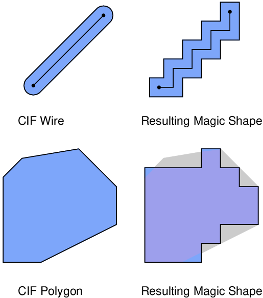

* TOC
{:toc }

Magic Tutorial \#9: Format Conversion for
CIF and Calma  
John Ousterhout  
Computer Science Division  
Electrical Engineering and Computer Sciences  
University of California  
Berkeley, CA 94720  
(Updated by others, too.)  
This tutorial corresponds to Magic version 7.  

Tutorials to read first:

<table class="tabbing" data-cellpadding="0" data-border="0">
<colgroup>
<col style="width: 100%" />
</colgroup>
<tbody>
<tr class="odd tabbing" style="vertical-align:baseline;">
<td class="tabbing">Magic Tutorial #1: Getting Started 
Magic Tutorial #2: Basic Painting and Selection 
Magic Tutorial #4: Cell Hierarchies</td>
</tr>
</tbody>
</table>

Commands introduced in this
tutorial:

<table class="tabbing" data-cellpadding="0" data-border="0">
<tbody>
<tr class="odd tabbing" style="vertical-align:baseline;">
<td class="tabbing">:calma, :cif</td>
</tr>
</tbody>
</table>

Macros introduced in this tutorial:

<table class="tabbing" data-cellpadding="0" data-border="0">
<tbody>
<tr class="odd tabbing" style="vertical-align:baseline;">
<td class="tabbing">(None)</td>
</tr>
</tbody>
</table>

### 1  Basics

CIF (Caltech Intermediate Form) and Calma Stream Format are standard
layout description languages used to transfer mask-level layouts between
organizations and design tools. This tutorial describes how Magic can be
used to read and write files in CIF and Stream formats. The version of
CIF that Magic supports is CIF 2.0; it is the most popular layout
language in the university design community. The Calma format that Magic
supports is GDS II Stream format, version 3.0, corresponding to GDS II
Release 5.1. This is probably the most popular layout description
language for the industrial design community.

To write out a CIF file, place the cursor over a layout window and type
the command

<table class="tabbing" data-cellpadding="0" data-border="0">
<tbody>
<tr class="odd tabbing" style="vertical-align:baseline;">
<td class="tabbing">:cif</td>
</tr>
</tbody>
</table>

This will generate a CIF file called name.cif, where name is the name of the root cell in the
window. The CIF file will contain a description of the entire cell
hierarchy in that window. If you wish to use a name different from the
root cell, type the command

<table class="tabbing" data-cellpadding="0" data-border="0">
<tbody>
<tr class="odd tabbing" style="vertical-align:baseline;">
<td class="tabbing">:cif write file</td>
</tr>
</tbody>
</table>

This will store the CIF in file.cif. Start Magic up to edit tut9a and generate CIF for that cell. The
CIF file will be in ASCII format, so you can use Unix commands like
more and vi to see what it contains.

To read a CIF file into Magic, place the cursor over a layout window and
type the command

<table class="tabbing" data-cellpadding="0" data-border="0">
<tbody>
<tr class="odd tabbing" style="vertical-align:baseline;">
<td class="tabbing">:cif read file</td>
</tr>
</tbody>
</table>

This will read the file file.cif (which must be in CIF format),
generate Magic cells for the hierarchy described in the file, make the
entire hierarchy a subcell of the edit cell, and run the design-rule
checker to verify everything read from the file. Information in the
top-level cell (usually just a call on the “main” cell of the layout)
will be placed into the edit cell. Start Magic up afresh and read in
tut9a.cif, which you created above.
It will be easier if you always read CIF when Magic has just been
started up: if some of the cells already exist, the CIF reader will not
overwrite them, but will instead use numbers for cell names.

To read and write Stream-format files, use the commands :calma read and :calma, respectively. These commands have
the same effect as the CIF commands, except that they operate on files
with .strm extensions. Stream is a
binary format, so you can’t examine .strm
files with a text editor.

Stream files do not identify a top-level cell, so you won’t see anything
on the screen after you’ve used the :calma
read command. You’ll have to use the :load command to look at the cells you
read. However, if Magic was used to write the Calma file being read, the
library name reported by the :calma read
command is the same as the name of the root cell for that
library.

Also, Calma format places some limitations on the names of cells: they
can only contain alphanumeric characters, “$”, and “\_”, and can be at most 32
characters long. If the name of a cell does not meet these limitations,
:calma write converts it to a unique
name of the form \_\_\_\_\_\_n,
where n is a small integer. To
avoid any possible conflicts, you should avoid using names like these
for your own cells.

You shouldn’t need to know much more than what’s above in order to read
and write CIF and Stream. The sections below describe the different
styles of CIF/Calma that Magic can generate and the limitations of the
CIF/Calma facilities (you may have noticed that when you wrote and read
CIF above you didn’t quite get back what you started with; Section 3
describes the differences that can occur). Although the discussion
mentions only CIF, the same features and problems apply to Calma.

### 2  Styles

Magic usually knows several different ways to generate CIF/Calma from a
given layout. Each of these ways is called a style. Different styles can be used to
handle different fabrication facilities, which may differ in the names
they use for layers or in the exact mask set required for fabrication.
Different styles can be also used to write out CIF/Calma with slightly
different feature sizes or design rules. CIF/Calma styles are described
in the technology file that Magic reads when it starts up; the exact
number and nature of the styles is determined by whoever wrote your
technology file. There are separate styles for reading and writing
CIF/Calma; at any given time, there is one current input style and one
current output style.

The standard SCMOS technology file provides an example of how different
styles can be used. Start up Magic with the SCMOS technology (magic -Tscmos). Then type the commands

<table class="tabbing" data-cellpadding="0" data-border="0">
<colgroup>
<col style="width: 100%" />
</colgroup>
<tbody>
<tr class="odd tabbing" style="vertical-align:baseline;">
<td class="tabbing">:cif
ostyle 
:cif istyle</td>
</tr>
</tbody>
</table>

The first command will print out a list of all the styles in which Magic
can write CIF/Calma (in this technology) and the second command prints
out the styles in which Magic can read CIF/Calma. You use the :cif command to change the current styles,
but the styles are used for both CIF and Calma format conversion. The
SCMOS technology file provides several output styles. The initial
(default) style for writing CIF is lambda=1.0(gen). This style generates mask
layers for the MOSIS scalable CMOS process, where each Magic unit
corresponds to 1 micron and both well polarities are generated. See the
technology manual for more information on the various styles that are
available. You can change the output style with the command

<table class="tabbing" data-cellpadding="0" data-border="0">
<tbody>
<tr class="odd tabbing" style="vertical-align:baseline;">
<td class="tabbing">:cif ostyle
newStyle</td>
</tr>
</tbody>
</table>

where newStyle is the new style
you’d like to use for output. After this command, any future CIF or
Calma files will be generated with the new style. The :cif istyle command can be used in the
same way to see the available styles for reading CIF and to change the
current style.

Each style has a specific scalefactor; you can’t use a particular style
with a different scalefactor. To change the scalefactor, you’ll have to
edit the appropriate style in the cifinput
or cifoutput section of the
technology file. This process is described in “Magic Maintainer’s Manual
\#2: The Technology File.”

### 3  Rounding

The units used for coordinates in Magic are generally different from
those in CIF files. In Magic, most technology files use lambda-based
units, where one unit is typically half the minimum feature size. In CIF
files, the units are centimicrons (hundredths of a micron). When reading
CIF and Calma files, an integer scalefactor is used to convert from
centimicrons to Magic units. If the CIF file contains coordinates that
don’t scale exactly to integer Magic units, Magic rounds the coordinates
up or down to the closest integer Magic units. A CIF coordinate exactly
halfway between two Magic units is rounded down. The final authority on
rounding is the procedure CIFScaleCoord in the file cif/CIFreadutils.c
When rounding occurs, the resulting Magic file will not match the CIF
file exactly.

Technology files usually specify geometrical operations such as
bloating, shrinking, and-ing, and or-ing to be performed on CIF
geometries when they are read into Magic. These geometrical operations
are all performed in the CIF coordinate system (centimicrons) so there
is no rounding or loss of accuracy in the operations. Rounding occurs
only AFTER the geometrical operations, at the last possible instant
before entering paint into the Magic database.

### 4  Non-Manhattan Geometries

Magic only supports Manhattan features. When CIF or Calma files contain
non-Manhattan features, they are approximated with Manhattan ones. The
approximations occur for wires (if the centerline contains non-Manhattan
segments) and polygons (if the outline contains non-Manhattan segments).
In these cases, the non-Manhattan segments are replaced with one or more
horizontal and vertical segments before the figure is processed.
Conversion is done by inserting a one-unit stairstep on a 45-degree
angle until a point is reached where a horizontal or vertical line can
reach the segment’s endpoint. Some examples are illustrated in the
figure below: in each case, the figure on the left is the one specified
in the CIF file, and the figure on the right is what results in Magic.

<figure>

</figure>

The shape of the Magic stairstep depends on the order in which vertices
appear in the CIF or Calma file. The stairstep is made by first
incrementing or decrementing the x-coordinate, then incrementing or
decrementing the y-coordinate, then x, then y, and so on. For example,
in the figure above, the polygon was specified in counter-clockwise
order; if it had been specified in clockwise order the result would have
been slightly different.

An additional approximation occurs for wires. The CIF wire figure
assumes that round caps will be generated at each end of the wire. In
Magic, square caps are generated instead. The top example of the figure
above illustrates this approximation.

### 5  Other Problems with Reading and Writing CIF

You may have noticed that when you wrote out CIF for tut9a and read it back in again, you
didn’t get back quite what you started with. Although the differences
shouldn’t cause any serious problems, this section describes what they
are so you’ll know what to expect. There are three areas where there may
be discrepancies: labels, arrays, and contacts. These are illustrated in
tut9b. Load this cell, then generate
CIF, then read the CIF back in again. When the CIF is read in, you’ll
get a couple of warning messages because Magic won’t allow the CIF to
overwrite existing cells: it uses new numbered cells instead (this is
why you should normally read CIF with a “clean slate”; in this case it’s
convenient to have both the original and reconstructed infromation
present at the same time; just ignore the warnings). The information
from the CIF cell appears as a subcell named 1 right on top of the old contents of
tut9b; select 1, move it below tut9b, and expand it so you can compare
its contents to tut9b.

The first problem area is that CIF normally allows only point labels. By
default, where you have line or box labels in Magic, CIF labels are
generated at the center of the Magic labels. The label in in tut9y
is an example of a line label that gets smashed in the CIF
processing. The command

<table class="tabbing" data-cellpadding="0" data-border="0">
<tbody>
<tr class="odd tabbing" style="vertical-align:baseline;">
<td class="tabbing">:cif arealabels
yes</td>
</tr>
</tbody>
</table>

sets a switch telling Magic to use an extension to cif to output
area-labels. This is not the default since many programs that take CIF
as input do not understand this extension.

If you are reading a CIF file created by a tool other than Magic, there
is an additional problems with labels. The CIF label construct (“94 label x y
layer”) has an optional layer
field that indicates the layer to which a label is attached. If
reading a CIF file generated by Magic, this field is always present and
so a label’s layer is unambiguous. However, if the field is absent,
Magic must decide which layer to use. It does this by looking to see
what Magic layers lie beneath the label after the CIF has been read in.
When there are several layers, it chooses the one appearing LATEST in
the types section of the technology
file. Usually, it’s possible to ensure that the right layer is used by
placing signal layers (such as metal, diffusion, and poly) later in the
types section than layers such as pwell or nplus. However, sometimes
Magic will still pick the wrong layer, and it will be up to you to move
the label to the right layer yourself.

The second problem is with arrays. CIF has no standard array construct,
so when Magic outputs arrays it does it as a collection of cell
instances. When the CIF file is read back in, each array element comes
back as a separate subcell. The array of tut9y cells is an example of this. Most
designs only have a few arrays that are large enough to matter; where
this is the case, you should go back after reading the CIF and replace
the multiple instances with a single array. Calma format does have an
array construct, so it doesn’t have this problem.

The third discrepancy is that where there are large contact areas, when
CIF is read and written the area of the contact may be reduced slightly.
This happened to the large poly contact in tut9b. The shrink doesn’t reduce the
effective area of the contact; it just reduces the area drawn in Magic.
To see what’s happening here, place the box around tut9b and 1, expand everything, then type

<table class="tabbing" data-cellpadding="0" data-border="0">
<tbody>
<tr class="odd tabbing" style="vertical-align:baseline;">
<td class="tabbing">:cif see
CCP</td>
</tr>
</tbody>
</table>

This causes feedback to be displayed showing CIF layer “CCP” (contact
cut to poly). You may have to zoom in a bit to distinguish the
individual via holes. Magic generates lots of small contact vias over
the area of the contact, and if contacts aren’t exact multiples of the
hole size and spacing then extra space is left around the edges. When
the CIF is read back in, this extra space isn’t turned back into
contact. The circuit that is read in is functionally identical to the
original circuit, even though the Magic contact appears slightly
smaller.

There is an additional problem with generating CIF having to do with the
cell hierarchy. When Magic generates CIF, it performs geometric
operations such as “grow” and “shrink”on the mask layers. Some of these
operations are not guaranteed to work perfectly on hierarchical designs.
Magic detects when there are problems and creates feedback areas to mark
the trouble spots. When you write CIF, Magic will warn you that there
were troubles. These should almost never happen if you generate CIF from
designs that don’t have any design-rule errors. If they do occur, you
can get around them by writing cif with the following command

<table class="tabbing" data-cellpadding="0" data-border="0">
<tbody>
<tr class="odd tabbing" style="vertical-align:baseline;">
<td class="tabbing">:cif flat fileName</td>
</tr>
</tbody>
</table>

This command creates an internal version of the design with hierarchy
removed, before outputing CIF as in cif
write. An alternative approach that does not require flattening
is to modify the technology file in use. Read “Magic Maintainers Manual
\#2: The Technology File”, if you want to try this approach.
